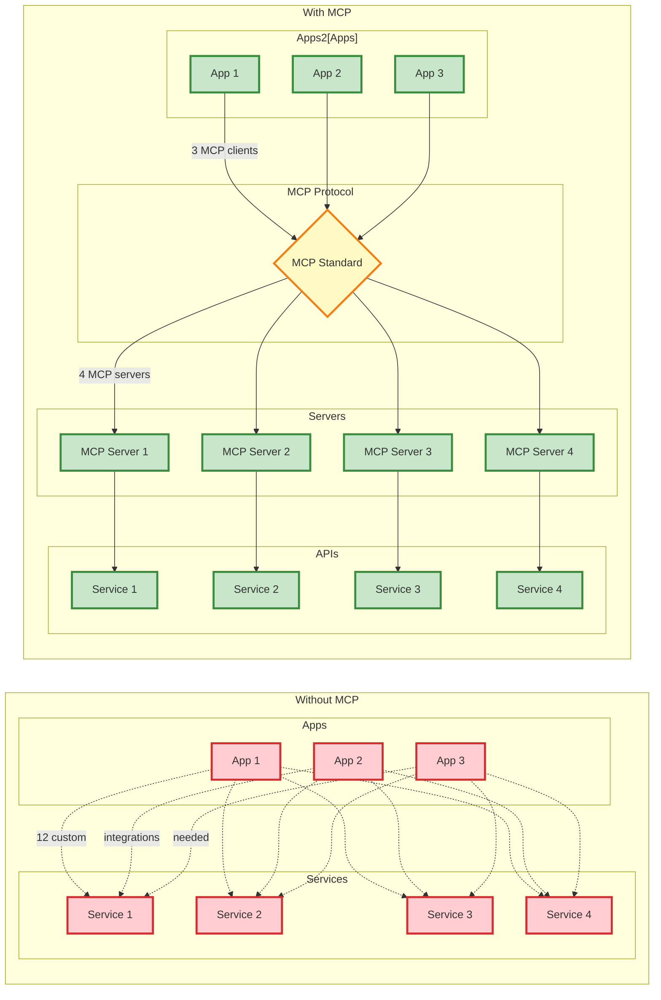

The **Model Context Protocol (MCP)** is revolutionizing how we build AI integrations, and as C# developers, we now have powerful tools to participate in this ecosystem. Think of MCP as "**USB for AI integrations**" - a standard that eliminates the chaos of custom connectors and creates a unified way for AI applications to interact with external systems.

## The Integration Problem MCP Solves

Before diving into C# implementation, let's understand the core problem. Traditionally, integrating AI applications with external tools creates an "**M×N problem**":



If you have **M** AI applications and **N** external systems, you potentially need **M×N** different integrations. MCP transforms this into an "**M+N problem**" by providing a standardized protocol.

> MCP eliminates duplicated integration effort and creates consistent implementations across your entire AI ecosystem.
{: .prompt-tip }

## MCP Architecture Overview

MCP follows a client-server architecture with three key components:

### 1. Hosts
Applications users interact with (Claude Desktop, Cursor IDE, custom agents)

### 2. Clients  
Live within host applications, managing connections to MCP servers (1:1 relationship)

### 3. Servers
External programs exposing capabilities via standardized APIs

```yaml
mcp_components:
  tools: "Model-controlled functions (like function calling)"
  resources: "Application-controlled data sources (like GET endpoints)"
  prompts: "User-controlled templates for optimal interactions"
```


## Getting Started with C# Dynamic MCP Implementation

Let's build a practical MCP server in C#. First, install the required package:

```xml
<PackageReference Include="ModelContextProtocol" Version="0.1.0-preview.11" />
```

## First, dynamic? Universal REST-to-MCP Translation

The dynamic handler functions as a **universal translator** that transforms any REST API into MCP-compliant tools without requiring custom code for each integration. The process operates as follows:

**Input**: MCP tool request with parameters → **Output**: Standardized MCP response

The handler analyzes each tool's configuration and automatically determines the appropriate HTTP pattern:

- **Parameterized URLs** (`/api/weather/{city}`) → Extracts the `city` parameter from MCP arguments and constructs the URL
- **Query Parameters** → Converts remaining MCP arguments into URL query strings  
- **POST Payloads** → Serializes MCP arguments as JSON request bodies
- **Simple GET Requests** → Executes direct API calls for parameter-less tools

**The Result**: Any REST endpoint becomes immediately available to MCP-compatible AI applications. Whether interfacing with weather APIs, database queries, or complex enterprise services, the handler seamlessly converts REST responses back into standardized MCP format that AI agents can interpret and utilize.

This approach demonstrates simply how to **register new tools within seconds** rather than investing hours in writing custom integration code. **Important note: authentication is not taken into account in this implementation**. The AI ecosystem gains universal access to your APIs while you maintain complete control over how they are exposed.

## Building the Core Dynamic Tool Handler

Find the code here: [DynamicMCP](https://github.com/sjoerdteunisse/DynamicMCP)

The heart of any MCP server is the tool handler. This component receives tool invocation requests from MCP clients and executes the corresponding functionality. Our implementation supports three different types of HTTP operations based on the tool configuration:

```csharp
using System.Collections.Concurrent;
using System.Text.Json;
using ModelContextProtocol.Protocol.Types;
using ModelContextProtocol.Server;

namespace ToolAPI.Services;

public class CallToolHandler
{
    public async ValueTask<ModelContextProtocol.Protocol.Types.CallToolResponse> Handler(RequestContext<CallToolRequestParams> context, CancellationToken cancellationToken)
    {
        var toolRegistry = context.Services.GetRequiredService<ConcurrentDictionary<string, ToolDefinition>>();
        var tool = toolRegistry.Values.FirstOrDefault(x => x.Name == context.Params.Name);
        var toolName = tool?.Name;
        var inputs = context.Params.Arguments;

        if (tool != null)
        {
            using var httpClient = new HttpClient();
            bool isEmptyInputSchema = tool.InputSchema.GetProperty("properties").EnumerateObject().Any() == false;
            JsonElement responseContent;

            if (tool.EndpointUrl.Contains("{"))
            {
                // Handle GET with placeholder replacement
                string dynamicUrl = tool.EndpointUrl;
                var queryParams = new Dictionary<string, string>();

                // Extract input values from Arguments
                if (inputs != null)
                {
                    foreach (var prop in tool.InputSchema.GetProperty("properties").EnumerateObject())
                    {
                        string propName = prop.Name;
                        if (inputs.TryGetValue(propName, out var inputValue))
                        {
                            string value = inputValue.ValueKind switch
                            {
                                JsonValueKind.String => inputValue.GetString(),
                                JsonValueKind.Number => inputValue.GetDouble().ToString(),
                                JsonValueKind.True => "true",
                                JsonValueKind.False => "false",
                                _ => inputValue.ToString()
                            };

                            // Replace placeholder in URL if present
                            string placeholder = $"{{{propName}}}";
                            if (dynamicUrl.Contains(placeholder))
                            {
                                dynamicUrl = dynamicUrl.Replace(placeholder, Uri.EscapeDataString(value));
                            }
                            else
                            {
                                // Add to query parameters
                                queryParams[propName] = value;
                            }
                        }
                    }
                }

                // Append query parameters
                if (queryParams.Any())
                {
                    var queryString = string.Join("&", queryParams.Select(kvp => $"{Uri.EscapeDataString(kvp.Key)}={Uri.EscapeDataString(kvp.Value)}"));
                    dynamicUrl += dynamicUrl.Contains("?") ? "&" : "?";
                    dynamicUrl += queryString;
                }

                // Validate URL
                if (!Uri.TryCreate(dynamicUrl, UriKind.Absolute, out var uri))
                {
                    return new ModelContextProtocol.Protocol.Types.CallToolResponse { IsError = true, Content = new List<Content> { new Content { Type = "text", Text = "{\"error\": \"Invalid URL after placeholder replacement\"}" } } };
                }

                var response = await httpClient.GetAsync(dynamicUrl, cancellationToken);
                if (!response.IsSuccessStatusCode)
                {
                    return new ModelContextProtocol.Protocol.Types.CallToolResponse { IsError = true, Content = new List<Content> { new Content { Type = "text", Text = "{\"error\": \"Failed to fetch data\"}" } } };
                }

                responseContent = await response.Content.ReadFromJsonAsync<JsonElement>(cancellationToken: cancellationToken);
            }
            else if (isEmptyInputSchema)
            {
                // Standard GET for empty schema
                var response = await httpClient.GetAsync(tool.EndpointUrl, cancellationToken);
                if (!response.IsSuccessStatusCode)
                {
                    return new ModelContextProtocol.Protocol.Types.CallToolResponse { IsError = true, Content = new List<Content> { new Content { Type = "text", Text = "{\"error\": \"Failed to fetch data\"}" } } };
                }

                responseContent = await response.Content.ReadFromJsonAsync<JsonElement>(cancellationToken: cancellationToken);
            }
            else
            {
                // POST for non-empty schema without placeholders
                var response = await httpClient.PostAsJsonAsync(tool.EndpointUrl, inputs, cancellationToken);
                if (!response.IsSuccessStatusCode)
                {
                    return new ModelContextProtocol.Protocol.Types.CallToolResponse { IsError = true, Content = new List<Content> { new Content { Type = "text", Text = "{\"error\": \"Failed to post data\"}" } } };
                }

                responseContent = await response.Content.ReadFromJsonAsync<JsonElement>(cancellationToken: cancellationToken);
            }

            var content = new Content { Type = "text", Text = JsonSerializer.Serialize(responseContent) };
            return new ModelContextProtocol.Protocol.Types.CallToolResponse { IsError = false, Content = new List<Content> { content } };
        }

        throw new Exception($"Tool '{toolName}' not found.");
    }
}
```

This handler implements intelligent HTTP request routing based on the tool's configuration:

**Parameterized URLs**: When the endpoint URL contains placeholders like for example `{latitude}`, the handler extracts values from the input arguments and replaces them in the URL. Any remaining parameters become query parameters.

**Empty Schema Tools**: Tools with no input parameters trigger simple GET requests to the endpoint URL.

**Complex Tools**: Tools with input schemas but no URL placeholders send POST requests with the input data as the request body.

The handler also includes comprehensive error handling, returning structured error responses when requests fail or URLs are malformed.

## Dynamic Tool Management

One of the most powerful features of this MCP implementation is the ability to dynamically register and manage tools at runtime. This is handled through a REST API controller:

```csharp
using Microsoft.AspNetCore.Mvc;
using ModelContextProtocol.Protocol.Types;
using System.Collections.Concurrent;
using System.Text.Json;

[ApiController]
[Route("api/[controller]")]
public class ToolController : ControllerBase
{
    private readonly ConcurrentDictionary<string, ToolDefinition> _toolRegistry;

    public ToolController(ConcurrentDictionary<string, ToolDefinition> toolRegistry)
    {
        _toolRegistry = toolRegistry;
    }

    [HttpPost]
    public IActionResult AddTool([FromBody] AddToolRequest request)
    {
        if (string.IsNullOrEmpty(request.Name) || string.IsNullOrEmpty(request.EndpointUrl))
        {
            return BadRequest("Tool name and endpoint URL are required.");
        }

        if (_toolRegistry.ContainsKey(request.Name))
        {
            return BadRequest($"Tool '{request.Name}' already exists.");
        }

        // Parse InputSchema JSON string to JsonElement
        JsonElement inputSchema;
        try
        {
            inputSchema = JsonSerializer.Deserialize<JsonElement>(request.InputSchemaJson);
        }
        catch (JsonException ex)
        {
            return BadRequest($"Invalid InputSchema JSON: {ex.Message}");
        }

        var tool = new ToolDefinition
        {
            Name = request.Name,
            Description = request.Description,
            InputSchema = inputSchema,
            Annotations = request.Annotations,
            EndpointUrl = request.EndpointUrl
        };

        _toolRegistry.TryAdd(request.Name, tool);
        return Ok($"Tool '{request.Name}' added successfully.");
    }
}
```

This controller allows you to register new MCP tools without restarting the server. The dynamic registration system works by:

**Validation**: Ensuring required fields (name, endpoint URL) are provided and tools aren't duplicated.

**Schema Parsing**: Converting the JSON schema string into a `JsonElement` for runtime schema validation.

**Thread-Safe Storage**: Using `ConcurrentDictionary` to safely store tool definitions across multiple concurrent requests.

**Immediate Availability**: Once registered, tools are immediately available to MCP clients without any server restart.

## Supporting Data Models

The implementation uses several key data models that define the structure of tools and requests:

```csharp
public class ToolDefinition
{
    public string Name { get; set; }
    public string Description { get; set; }
    public JsonElement InputSchema { get; set; }
    public ToolAnnotations Annotations { get; set; }
    public string EndpointUrl { get; set; }
}

// Models/AddToolRequest.cs
public class AddToolRequest
{
    public string Name { get; set; }
    public string Description { get; set; }
    public string InputSchemaJson { get; set; } // Accept JSON string
    public ToolAnnotations Annotations { get; set; }
    public string EndpointUrl { get; set; }
}

// Models/CallToolResponse.cs
public class CallToolResponse
{
    public bool IsError { get; set; }
    public JsonElement Content { get; set; }
}

// Models/CallToolResult.cs
public class CallToolResult
{
    public bool IsError { get; set; }
    public JsonElement Content { get; set; }
}

public class ListToolsResult
{
    public List<Tool> Tools { get; set; }
}
```

These models provide the foundation for tool management:

**ToolDefinition**: The core model representing an MCP tool, including its name, description, input schema, annotations for AI understanding, and the endpoint URL.

**AddToolRequest**: The request model for registering new tools, accepting a JSON string for the input schema to allow flexible schema definitions.

**Response Models**: Standardized response structures that maintain consistency with the MCP protocol specifications.

The use of `JsonElement` for schemas provides flexibility while maintaining type safety, allowing tools to define complex input validation rules without requiring compile-time type definitions.

## Practical Example: Weather Service Integration

Let's see how to register a real-world tool that demonstrates the power of parameterized URLs:

```json
{
    "name": "weather_forecast_berlin_input",
    "description": "Fetches weather forecast for Berlin",
    "inputSchemaJson": "{\"type\":\"object\",\"properties\":{\"latitude\":{\"type\":\"number\"}},\"required\":[\"latitude\"]}",
    "outputSchemaJson": "{\"type\":\"object\",\"properties\":{\"latitude\":{\"type\":\"number\"},\"longitude\":{\"type\":\"number\"},\"current\":{\"type\":\"object\",\"properties\":{\"temperature_2m\":{\"type\":\"number\"},\"wind_speed_10m\":{\"type\":\"number\"}}},\"hourly\":{\"type\":\"object\",\"properties\":{\"temperature_2m\":{\"type\":\"array\",\"items\":{\"type\":\"number\"}},\"relative_humidity_2m\":{\"type\":\"array\",\"items\":{\"type\":\"number\"}},\"wind_speed_10m\":{\"type\":\"array\",\"items\":{\"type\":\"number\"}}}}}}",
    "annotations": {
      "title": "Berlin Weather Forecast",
      "readOnlyHint": true,
      "destructiveHint": false,
      "idempotentHint": true,
      "openWorldHint": false
    },
   "endpointUrl": "https://api.open-meteo.com/v1/forecast?latitude={latitude}&longitude=13.41&current=temperature_2m,wind_speed_10m&hourly=temperature_2m,relative_humidity_2m,wind_speed_10m"
}
```

This weather tool demonstrates several key MCP concepts:

**Parameterized URLs**: The `{latitude}` placeholder gets replaced with the actual latitude value from the tool call arguments.

**JSON Schema Validation**: The input schema ensures that latitude is provided as a number and is required.

**Tool Annotations**: Metadata that helps AI systems understand the tool's behavior - it's read-only, not destructive, idempotent, and doesn't require external context.

**Structured Output**: The output schema defines the expected structure of weather data, helping AI systems parse and use the results effectively.

When an AI agent calls this tool with `{"latitude": 52.52}`, the MCP server will:

1. Replace `{latitude}` with `52.52` in the URL
2. Make a GET request to the Open-Meteo API
3. Return the structured weather data
4. The AI can then interpret and present this data to users

## Understanding Tool Annotations

The annotations in the weather example provide crucial metadata for AI systems:

**ReadOnlyHint**: Indicates the tool only reads data and doesn't modify external state. This helps AI systems understand they can call this tool safely without side effects.

**DestructiveHint**: Set to false, meaning this tool won't delete or harm data. AI systems can be more liberal in using non-destructive tools.

**IdempotentHint**: The tool can be called multiple times with the same inputs and produce the same results. This is important for retry logic and caching strategies.

**OpenWorldHint**: Set to false, indicating the tool works with a closed set of parameters. The AI doesn't need to guess what additional parameters might be useful.

## Real-World Integration Patterns

The flexible HTTP handling in our MCP server supports common enterprise integration patterns:

**REST API Integration**: Tools can wrap any REST API endpoint, automatically handling authentication headers, query parameters, and request bodies.

**Microservices Communication**: Each tool can represent a different microservice endpoint, allowing AI agents to orchestrate complex business workflows.

**Database Operations**: Through appropriate API endpoints, tools can trigger database queries, updates, or complex analytical operations.

**External Service Orchestration**: Tools can chain multiple external service calls, aggregating data from different sources before returning results to AI agents.


## Future Extensibility

This MCP server implementation is designed for extensibility:

**Authentication Ready**: The structure supports adding authentication middleware for enterprise security requirements.

**Caching Layer**: The design allows for adding response caching to improve performance for frequently called tools.

## Why MCP Matters for C# Developers

Model Context Protocol represents a significant shift in how we think about AI integrations:

**Ecosystem Interoperability**: Your C# MCP tools can be used by any MCP-compatible AI application, from Claude Desktop to custom agents.

**Reduced Integration Overhead**: Instead of building custom APIs for each AI application, you build one MCP server that works everywhere.

**Standardized Patterns**: MCP provides proven patterns for tool discovery, invocation, and error handling, reducing the cognitive load of API design.

**Future-Proof Architecture**: As the AI ecosystem evolves, MCP provides a stable foundation that adapts to new requirements.

> The Model Context Protocol is becoming the standard for AI tool integration, similar to how REST became the standard for web APIs.
{: .prompt-info }

## Getting Started Today

1. **Install the Package**: Add `ModelContextProtocol` version `0.1.0-preview.11` to your project
2. **Implement the Handler**: Use the provided `CallToolHandler` as your starting point
3. **Add the Controller**: Include the `ToolController` for dynamic tool management
4. **Register Your First Tool**: Try the weather API example to see it in action
5. **Expand Your Toolkit**: Add tools for your existing APIs and services

The Model Context Protocol is transforming AI development, and with these C# implementations, you're ready to participate in this revolution. Start building standardized AI integrations that work across the entire ecosystem of AI applications.