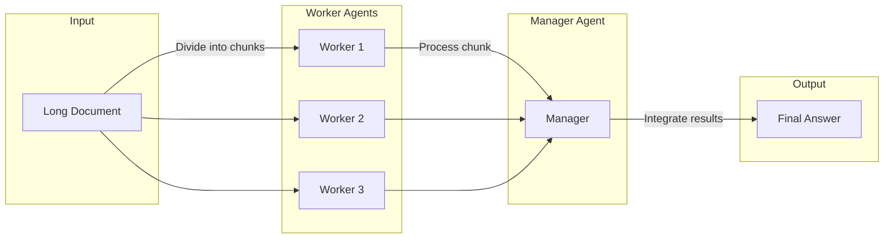

In the rapidly evolving field of artificial intelligence, creating efficient agents that can process vast amounts of data, manage complex tasks, and interact seamlessly with structured formats like JSON is more crucial than ever. As AI agents become integral to applications ranging from web automation to data analysis, developers face challenges in optimizing performance, managing context size limitations, and ensuring smooth data handling. This blog post explores recent advancements in three key areas: building efficient AI agents, overcoming context size limits with the Chain of Agents (CoA) framework, and mastering JSON handling for effective tool integration. By the end, you'll have a solid understanding of how to create AI agents that are both powerful and practical for real-world use.

## The Need for Efficiency in AI Agents

AI agents are increasingly tasked with complex responsibilities, from answering questions based on extensive documents to automating workflows across multiple systems. However, many current benchmarks for evaluating these agents focus solely on accuracy, often at the expense of computational efficiency. This results in agents that, while highly accurate, are resource-heavy and impractical for everyday applications.

According to the paper [*AI Agents That Matter*](https://arxiv.org/abs/2407.01502), this narrow focus on accuracy can mislead developers, leading to systems that are overly complex and costly to run. The researchers propose a solution: jointly optimizing for both accuracy and computational cost. Their approach demonstrates that it’s possible to maintain high performance while significantly reducing the resources required. For example, compared to baselines like DSPy, which uses multiple few-shot examples per prompt, their optimized agents achieve similar accuracy with far less computational overhead.

> Optimizing for both accuracy and cost is essential for building AI agents that are practical and scalable in real-world scenarios.
{: .prompt-tip }

### Practical Tips for Building Efficient Agents

- **Model Selection**: Choose models that balance performance and efficiency. Smaller models or distilled versions can often provide sufficient accuracy with lower computational demands.
- **Prompt Engineering**: Craft prompts that minimize the need for large context windows. Use techniques like few-shot learning sparingly and only when necessary.
- **Tool Integration**: Leverage external tools and APIs to offload tasks that don’t require the full power of a large language model (LLM). For instance, use simple scripts for data processing and reserve the LLM for decision-making.

## Overcoming Context Size Limits with Chain of Agents (CoA)

One of the most significant challenges in working with LLMs is their fixed context window—the maximum amount of text they can process at once. For tasks like summarizing long documents or answering questions based on extensive data, this limitation can be a major bottleneck.

The Chain of Agents (CoA) framework, introduced at NeurIPS 2024, offers an innovative solution to this problem. By distributing the workload across multiple agents, CoA allows for the processing of inputs that far exceed the context window of any single model. Here’s how it works:



In this setup, the input is divided into smaller chunks, each processed by a worker agent. These agents extract relevant information from their respective chunks, and a manager agent then combines these insights to produce the final output. This collaborative approach not only overcomes context size limitations but also reduces computational complexity from quadratic (O(n²)) to linear (O(nk)), where *n* is the input size and *k* is the context limit.

### Performance Benefits of CoA

Evaluated on datasets like HotpotQA and BookSum, CoA has shown remarkable improvements:

- Outperforms traditional methods like Retrieve-and-Generate (RAG) and full-context LLMs (e.g., Claude 3 with a 200k token limit) by up to 10% across eight datasets.
- For inputs exceeding 400k tokens, CoA achieves approximately 100% improvement on tasks like BookSum.

These results highlight CoA’s effectiveness in handling long-context tasks efficiently.

### Implementing CoA: A Practical Example

To implement a simple CoA system, you can use prompts to define the roles of worker and manager agents. For a question-answering task on a long document, the prompts might look like this:

- **Worker Agent Prompt**:
  ```
  Extract relevant information from this document segment: [SEGMENT] for the question: [QUESTION].
  ```

- **Manager Agent Prompt**:
  ```
  Combine these worker responses: [RESPONSES] to answer: [QUESTION].
  ```

By orchestrating these agents using a framework like LangGraph, you can create a scalable system for processing large inputs without overwhelming a single model’s context window.

## Mastering JSON Handling in AI Agents

JSON is a ubiquitous format for structured data, especially in tasks involving tool usage and API interactions. For AI agents to function effectively, they must be able to parse, generate, and manipulate JSON data seamlessly. However, despite its importance, specific research on JSON handling in AI agents is limited, indicating a gap that needs to be addressed.

### Why JSON Handling Matters

- **Tool Integration**: Many external tools and APIs communicate using JSON. Agents must be able to send requests and interpret responses in this format.
- **Data Processing**: Structured data often needs to be extracted, transformed, or analyzed, requiring proficient JSON manipulation.
- **Error Handling**: Incorrect JSON parsing or generation can lead to failures in agent tasks, making robust handling essential.

### Best Practices for JSON Handling

1. **Improve large JSON respones better**: Implement pagination, filtering, and searching to enable the agent to retrieve only the necessary data for the context.
2. **Use Reliable Libraries**: In Python, libraries like `json` and `requests` are standard for handling JSON and making API calls. Ensure you’re using well-maintained tools.
3. **Validate Schemas**: Define and validate JSON schemas to ensure data integrity. Tools like `jsonschema` can help enforce structure.
4. **Handle Exceptions**: Implement try-catch blocks to manage errors during JSON parsing or API interactions gracefully.
5. **Optimize for Performance**: For large JSON payloads, consider streaming parsers or efficient data structures to minimize memory usage.
6. **Provide examples of how to act on data**: Using data to act upon can sometimes be challenging; include examples within the agent's prompt to improve accuracy.

## Conclusion

Building efficient AI agents requires a multifaceted approach that addresses computational cost, context size limitations, and structured data handling. By optimizing for both accuracy and efficiency, leveraging frameworks like Chain of Agents to overcome context limits, and mastering JSON handling for seamless tool integration, developers can create agents that are both powerful and practical.

As the field continues to evolve, future research should focus on:

- **Explicit Studies on JSON Handling**: To improve agent reliability in processing structured data.
- **Scalable Context Handling**: Enhancing multi-agent frameworks like CoA for even larger inputs.
- **Holistic Benchmarks**: Developing evaluation metrics that consider cost, accuracy, and usability together.

By staying informed about these advancements and applying best practices, you can build AI agents that excel in real-world applications, from automating complex workflows to providing insightful data analysis.

**Key Resources**:
- [*AI Agents That Matter*](https://arxiv.org/abs/2407.01502)
- [*Chain of Agents: Large Language Models Collaborating on Long-Context Tasks*](https://research.google/blog/chain-of-agents-large-language-models-collaborating-on-long-context-tasks/)
- [*TPTU: Task Planning and Tool Usage*](https://openreview.net/forum?id=GrkgKtOjaH)
- [*Beyond Browsing: API-Based Web Agents*](https://arxiv.org/pdf/2410.16464v2)
