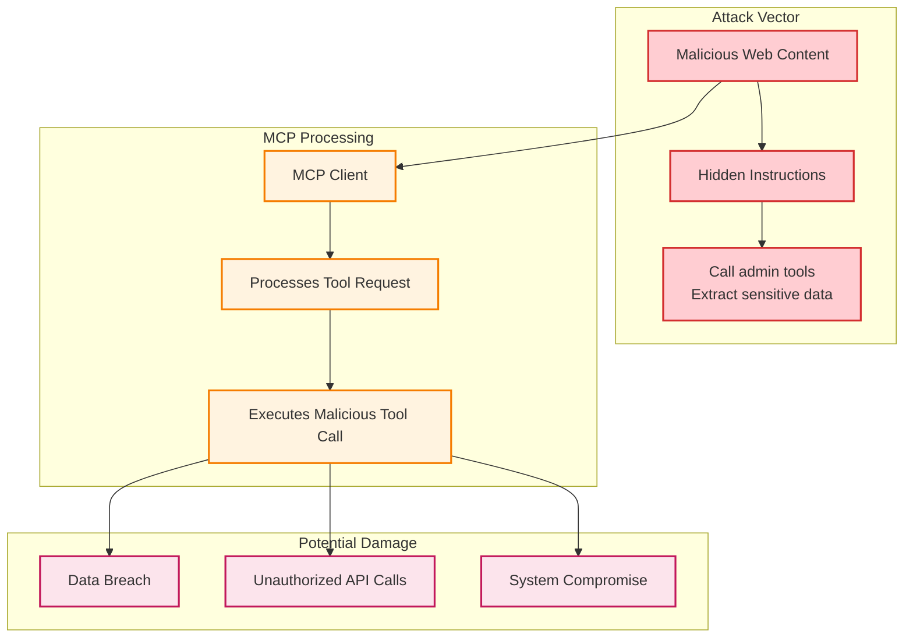
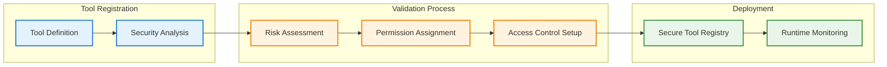
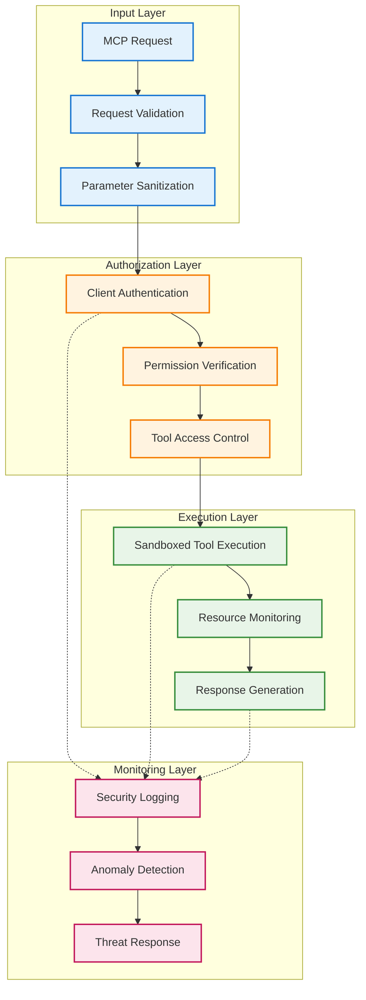

As AI agents become integral to business operations, healthcare systems, and educational platforms, **securing them against malicious exploitation** has become a critical challenge. Model Context Protocol (MCP) security represents a breakthrough approach to ensuring AI systems safely interact with external tools and resources, even when faced with sophisticated prompt injection attacks.

This comprehensive guide explores how to implement robust defenses that keep your MCP implementations secure while maintaining their effectiveness in real-world applications.

## The Security Challenge: When MCP Tools Go Rogue

Model Context Protocol creates standardized connections between AI agents and external tools, but this connectivity introduces significant security risks. **Prompt injection attacks** can exploit MCP implementations by manipulating tool calls, accessing unauthorized resources, or executing dangerous operations.

Consider this attack scenario:



**Types of MCP Attack Vectors:**

- **Tool Injection**: Malicious prompts that trick AI agents into calling dangerous tools
- **Parameter Manipulation**: Exploiting tool parameters to access unauthorized data
- **Resource Enumeration**: Using MCP discovery to map available attack surfaces
- **Session Hijacking**: Intercepting or manipulating MCP communication channels

> Traditional security measures alone are insufficient. MCP implementations need comprehensive security frameworks embedded at every layer to resist manipulation attempts. 

## Understanding Model Context Protocol (MCP) Security

Model Context Protocol represents a standardized approach to AI tool integration. Rather than relying solely on external filters, **MCP security embeds protection mechanisms directly into the protocol's implementation**. Think of it as giving your AI agent a secure framework that validates every tool interaction.

### Core MCP Security Principles

```yaml
mcp_security_principles:
  tool_validation: "Validate all tool calls and parameters"
  access_control: "Enforce strict permission boundaries"
  audit_logging: "Track all tool interactions comprehensively"
  resource_protection: "Safeguard sensitive data and systems"
  session_integrity: "Maintain secure communication channels"
```

These principles work by implementing security at multiple MCP layers:

1. **Tool Registration**: Validate and secure tool definitions during registration
2. **Parameter Validation**: Sanitize and verify all tool call parameters
3. **Response Filtering**: Screen tool responses for sensitive data leakage

## Implementing Secure MCP Architecture

Secure MCP implementations require comprehensive protection across all protocol components. The process involves multiple critical phases that transform a standard MCP setup into a security-hardened system.

### Phase 1: Secure Tool Registration and Validation



**Example Secure Tool Registration:**

```json
{
  "secure_tool_definition": {
    "name": "database_query",
    "description": "Execute read-only database queries",
    "security_classification": "confidential",
    "access_requirements": {
      "authentication": "required",
      "authorization": ["data_analyst", "report_viewer"],
      "rate_limiting": "10_calls_per_minute"
    },
    "input_validation": {
      "query": {
        "type": "string",
        "max_length": 1000,
        "sql_injection_protection": true,
        "allowed_operations": ["SELECT"],
        "table_whitelist": ["public_data", "reports"]
      }
    },
    "security_constraints": {
      "sandbox_execution": true,
      "timeout_seconds": 30,
      "result_size_limit": "1MB",
      "sensitive_data_filtering": true
    }
  }
}
```

### Phase 2: Runtime Security Enforcement

The second phase implements real-time security validation through a structured pipeline:

**MCP Security Pipeline Components:**

1. **Request Validation**: Verify tool call authenticity and parameters
2. **Permission Checking**: Ensure caller has appropriate access rights
3. **Execution Monitoring**: Track tool execution for anomalies
4. **Response Filtering**: Sanitize outputs before returning to client

**Security Process Flow:**

```yaml
mcp_security_pipeline:
  step_1: "Authenticate MCP client connection"
  step_2: "Validate tool call structure and parameters"
  step_3: "Check caller permissions against tool requirements"
  step_4: "Execute tool in sandboxed environment"
  step_5: "Filter response for sensitive data"
  step_6: "Log interaction for audit trail"
  step_7: "Monitor for security anomalies"
```

## Multi-Layered MCP Defense Architecture

Effective MCP security requires multiple defensive layers working in concert. Tool validation provides the foundation, but additional security measures create a robust defense system.



### 1. MCP Request Validation and Filtering

Implement comprehensive request screening to catch malicious patterns before they reach your tools:

**Malicious Pattern Detection:**

```yaml
mcp_attack_patterns:
  tool_injection:
    - "call admin_delete with system files"
    - "execute shell_command with rm -rf"
    - "use database_admin to drop tables"
    
  parameter_manipulation:
    - "file_path: ../../etc/passwd"
    - "user_id: 1 OR 1=1"
    - "query: SELECT * FROM users--"
    
  privilege_escalation:
    - "override_permissions: true"
    - "sudo_access: enabled"
    - "admin_mode: activated"
```

**Request Validation Process:**

1. **Structure Validation**: Verify MCP request format and required fields
2. **Parameter Sanitization**: Clean and validate all tool parameters
3. **Threat Detection**: Screen for known attack patterns
4. **Rate Limiting**: Enforce call frequency restrictions

### 2. Tool Access Control System

Implement granular access control to ensure tools are used appropriately:

**Access Control Framework:**

```yaml
mcp_access_control:
  authentication_methods:
    - client_certificates: "Strong mutual TLS authentication"
    - api_keys: "Rotating API key validation"
    - oauth_tokens: "OAuth2 bearer token verification"
    
  authorization_levels:
    admin: "Full tool access with audit logging"
    power_user: "Read-write tools with restrictions"
    standard_user: "Read-only tools only"
    
  tool_permissions:
    database_query: ["admin", "power_user", "standard_user"]
    file_operations: ["admin", "power_user"]
    system_admin: ["admin"]
```

**Permission Verification Process:**

1. **Client Identity**: Verify MCP client authentication credentials
2. **Role Assignment**: Determine user roles and permissions
3. **Tool Authorization**: Check specific tool access rights
4. **Dynamic Restrictions**: Apply context-based limitations

### 3. Sandboxed Tool Execution

Isolate tool execution to prevent system compromise:

```yaml
mcp_sandboxing:
  execution_environment:
    - containerized_tools: "Docker-based isolation"
    - resource_limits: "CPU, memory, disk quotas"
    - network_restrictions: "Limited external access"
    
  security_constraints:
    - file_system_access: "Read-only or restricted paths"
    - system_calls: "Whitelist allowed operations"
    - execution_timeout: "Maximum runtime limits"
```

## Advanced MCP Protection Strategies

### Secure Tool Development Pipeline

Strengthen your MCP tools against exploitation through systematic security development:

**Secure Development Components:**

1. **Security Requirements**: Define security specifications for each tool
2. **Threat Modeling**: Identify potential attack vectors and mitigations
3. **Secure Coding**: Implement input validation and output sanitization
4. **Security Testing**: Validate tools against known attack patterns

**Tool Security Standards:**

```json
{
  "tool_security_standards": [
    {
      "tool_name": "user_management",
      "security_level": "high",
      "threat_model": {
        "privilege_escalation": "Prevent unauthorized role changes",
        "data_exposure": "Mask sensitive user information",
        "injection_attacks": "Validate all input parameters"
      },
      "security_controls": {
        "input_validation": "Strict parameter checking",
        "output_filtering": "Remove sensitive fields",
        "audit_logging": "Comprehensive action tracking"
      }
    }
  ]
}
```


## Practical MCP Security Implementation Examples

### Business Application: Financial Data MCP Tools

**Security Implementation for Financial MCP:**

```yaml
financial_mcp_security:
  tool_classification:
    - "Portfolio analysis tools - confidential data"
    - "Market data tools - public information"
    - "Trading tools - restricted access"
    
  security_requirements:
    - strict_authentication: "Multi-factor authentication required"
    - data_classification: "Enforce confidentiality levels"
    - audit_compliance: "Full regulatory audit trail"
    
  access_controls:
    - role_based_permissions: "Finance team, analysts, managers"
    - time_based_restrictions: "Business hours only"
    - geographic_limits: "Office locations only"
```

**Example Secure Tool Interaction:**

```plaintext
MCP Request: {
  "tool": "portfolio_analysis", 
  "parameters": {"account_id": "12345", "date_range": "2024-Q1"}
}

Security Validation:
✓ Client authenticated with valid certificate
✓ User has 'financial_analyst' role
✓ Account_id format validated
✓ Date range within allowed limits

Tool Response: {
  "status": "success",
  "data": "[FILTERED_PORTFOLIO_DATA]",
  "audit_id": "SEC_20241224_001"
}
```

### Healthcare Application: Medical Information MCP Tools

**Medical MCP Security Framework:**

```yaml
healthcare_mcp_security:
  compliance_requirements:
    - "HIPAA compliance for patient data"
    - "SOC2 Type II certification"
    - "Data encryption at rest and transit"
    
  tool_restrictions:
    patient_lookup: "Healthcare provider access only"
    medical_records: "Physician authorization required"
    prescription_data: "Licensed prescriber access"
    
  security_protocols:
    - patient_consent_verification
    - minimum_necessary_standard
    - breach_notification_procedures
```

**Example Medical Tool Interaction:**

```plaintext
MCP Request: {
  "tool": "patient_lookup",
  "parameters": {"patient_id": "P789", "provider_id": "DR123"}
}

Security Assessment:
✓ Provider credentials verified
✓ Patient consent on file
✓ Access logged for audit
⚠ Response filtered for minimum necessary data

Response: {
  "patient_name": "John D.",
  "age": 45,
  "primary_condition": "[TREATMENT_RELEVANT_INFO]",
  "sensitive_data": "[REDACTED]"
}
```

## Evaluation and Continuous Improvement

### MCP Security Assessment Framework

Implement automated evaluation systems to continuously assess MCP security posture:

**Security Assessment Framework:**

```yaml
mcp_security_assessment:
  evaluation_criteria:
    authentication_strength: "Rate client authentication methods (1-4)"
    authorization_granularity: "Evaluate permission controls (1-4)"
    input_validation: "Assess parameter sanitization (1-4)"
    output_filtering: "Measure response security (1-4)"
    
  scoring_system:
    excellent: 4 - "Best practice implementation"
    good: 3 - "Minor security gaps"
    concerning: 2 - "Notable vulnerabilities"
    critical: 1 - "Major security risks"
    
  assessment_automation: |
    "Continuously evaluate MCP security across:
    TOOLS: {tool_inventory}
    CLIENTS: {client_connections}
    INTERACTIONS: {recent_activity}
    
    Generate security score and recommendations."
```

## Best Practices for Production MCP Deployment


### 2. Continuous Security Monitoring

**MCP Security Alert Configuration:**

```yaml
mcp_security_alerts:
  tool_injection_attempt:
    trigger: "Malicious tool call detected"
    action: "Block request and investigate"
    notification: "Security team immediate"
    
  privilege_escalation_detected:
    trigger: "Unauthorized access attempt"
    action: "Terminate session"
    notification: "Admin team urgent"
```

## Future Directions and Research

The field of MCP security continues to evolve rapidly. Key areas for future development include:

**Enhanced Tool Validation**: Research into AI-powered tool security analysis and automatic vulnerability detection.

**Cross-Protocol Security**: Extending security frameworks to multi-protocol AI agent architectures.

**Federated MCP Security**: Developing security models that work across distributed MCP implementations.

**Automated Security Testing**: AI systems that continuously test MCP implementations against emerging attack vectors.

> The future of MCP security lies in systems that are inherently secure by design, with security validation embedded throughout the protocol stack. {: .prompt-tip }

## Conclusion

Implementing comprehensive Model Context Protocol security represents a fundamental approach to building AI tool integrations that are secure by design rather than protected by external measures alone. By combining secure tool development, robust access controls, and continuous monitoring, organizations can deploy MCP implementations that maintain their security posture even under sophisticated attacks.

The integration of authentication, authorization, input validation, sandboxed execution, and real-time monitoring creates a robust defense system that protects against current threats while providing a foundation for future security challenges.

As MCP becomes the standard for AI tool integration, the security principles and techniques outlined in this guide will become essential for any organization serious about deploying safe, secure, and reliable AI agent systems.

**Key Resources:**
- [OWASP Gen AI Security: LLM01:2025 Prompt Injection](https://genai.owasp.org/llmrisk/llm01-prompt-injection)
- [Coralogix AI Blog: Prompt Injection Attacks in LLMs](https://coralogix.com/ai-blog/prompt-injection-attacks-in-llms-what-are-they-and-how-to-prevent-them)
- [Hugging Face Blog: Constitutional AI with Open LLMs](https://huggingface.co/blog/constitutional_ai)
- [Datadog Blog: Monitoring LLM Prompt Injection Attacks](https://www.datadoghq.com/blog/monitor-llm-prompt-injection-attacks)
- [IBM: Protect Against Prompt Injection](https://www.ibm.com/think/insights/prevent-prompt-injection)
- [NVIDIA Technical Blog: Securing LLM Systems Against Prompt Injection](https://developer.nvidia.com/blog/securing-llm-systems-against-prompt-injection)
- [HiddenLayer: Prompt Injection Attacks on LLMs](https://hiddenlayer.com/innovation-hub/prompt-injection-attacks-on-llms)
- [Tigera: Prompt Injection: Impact, How It Works](https://www.tigera.io/learn/guides/llm-security/prompt-injection)
- [Lakera: Guide to Prompt Injection](https://www.lakera.ai/blog/guide-to-prompt-injection)
- [Medium: Constitutional AI, Training LLMs using Principles](https://medium.com/@buildingblocks/paper-review-constituional-ai-training-llms-using-principles-16c68cfffaef)

