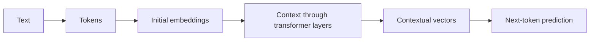
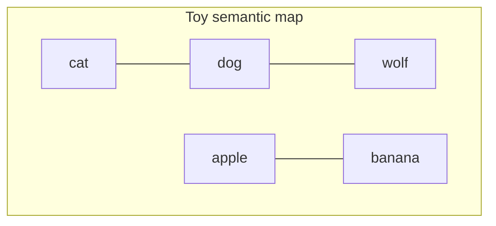
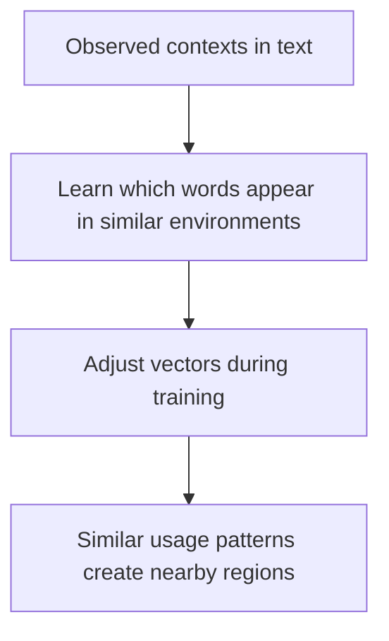
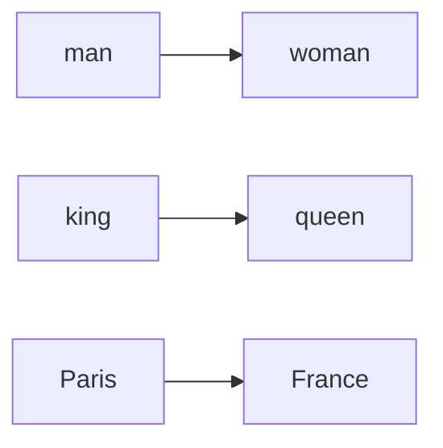
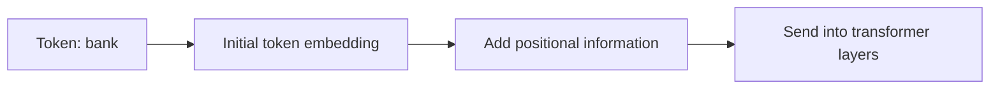
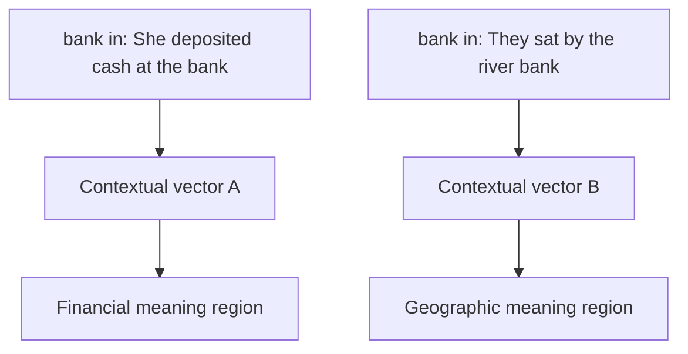
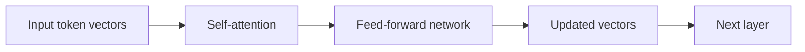
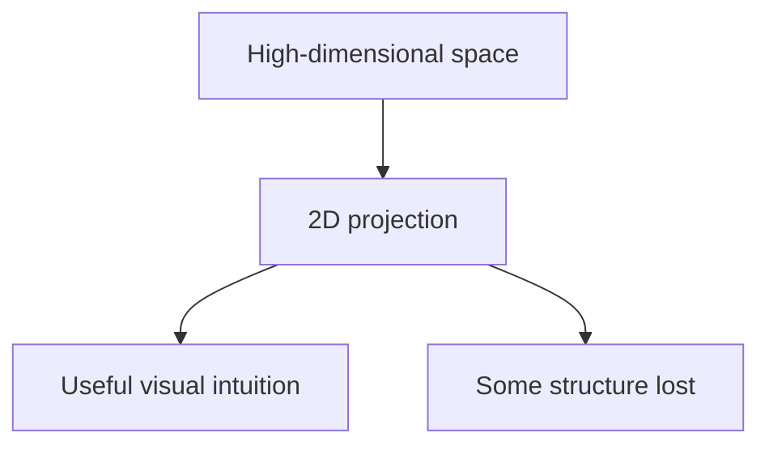
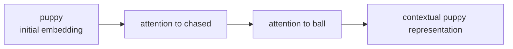

Large language models do not store meaning as dictionary definitions. They store it as patterns in a **vector space**: a high-dimensional geometry where tokens and concepts can become more or less related depending on how they are used in language.

That idea sounds abstract at first, but it becomes much clearer once you see the mechanics. This article explains what an LLM vector space is, why related meanings cluster together, how context changes vectors, and what actual research has shown about these semantic structures.

## The Big Picture

At a high level, vector space meaning works like this:

1. text is split into tokens
2. each token gets mapped to a vector
3. tokens used in similar contexts develop similar representations
4. transformer layers reshape those vectors using context
5. the final geometry helps the model predict the next token

The key idea is simple:

> In an LLM, meaning is not stored as a sentence or a rule. It is distributed across many numerical dimensions and becomes visible through geometric relationships.
{: .prompt-tip }

## What a Vector Space Actually Is

A **vector** is just a list of numbers.

For example, a toy vector might look like this:

`[0.42, -1.10, 0.08, 2.31]`

A real LLM embedding is much larger. Depending on the model, it may have hundreds, thousands, or more dimensions. Each token is mapped into that high-dimensional space.

You should not imagine one dimension meaning one simple human-readable property like:

- dimension 1 = animal
- dimension 2 = happy
- dimension 3 = formal

Real models are messier and richer than that. Meaning is usually encoded across **many directions at once**, not in one neat coordinate.

Still, a simplified picture helps:

In the real model, this structure lives in a space with many dimensions, not a flat diagram. But the intuition is right: related items often end up closer together than unrelated ones.

## Why Meaning Turns Into Geometry

The reason comes from a classic idea in linguistics called the **distributional hypothesis**:

> You can often understand a word by the company it keeps.

That idea is usually linked to J. R. Firth's famous line: *"You shall know a word by the company it keeps."* Modern embeddings operationalize that idea mathematically.

If the words `cat`, `dog`, and `rabbit` appear in similar environments, such as:

- `The ___ ran across the yard`
- `She fed the ___`
- `The ___ is a common household pet`

then a model that learns from those contexts has a strong reason to place them in related regions of space.

By contrast, a token like `democracy` appears in very different contexts:

- `The ___ depends on institutions`
- `Liberal ___ requires elections`
- `The constitution protects the ___`

So its vector is pushed in a different direction.

This is one of the deepest reasons vector spaces work: **language use creates statistical structure, and training turns that structure into geometry**.

## A Concrete Example of Similarity

Suppose a model sees many sentences like:

- `The cat slept on the couch`
- `The dog slept on the couch`
- `The puppy slept on the couch`

Then those tokens will likely share some nearby features in space.

But if the model also sees:

- `The cat chased the mouse`
- `The dog chased the ball`
- `The wolf hunted at night`

the geometry becomes richer. `dog` may end up close to `cat` on some directions, close to `wolf` on others, and farther away from `sofa` or `banana`.

That is important because meaning in LLMs is usually **multi-relational**:

- `dog` is close to `cat` as an animal
- `dog` is close to `puppy` by lifecycle and appearance
- `dog` is close to `wolf` by biological similarity
- `dog` is far from `democracy` in ordinary semantic space

So there is no single "meaning axis." There are many partially overlapping directions.

## What Research Showed Before LLMs

Modern LLM embeddings did not appear out of nowhere. They build on earlier research that showed semantic relationships can emerge from large text corpora.

### Word2Vec: Similar Contexts Create Useful Semantic Structure

A major milestone was **Word2Vec** by Mikolov and colleagues (2013). These models learned dense word vectors by predicting nearby words or by predicting a center word from its context.

The striking result was that the learned vectors captured meaningful relationships:

- semantically related words became neighbors
- some analogical relationships appeared as geometric directions
- vector arithmetic sometimes worked surprisingly well

The classic example was:

`king - man + woman ≈ queen`

That should not be treated as magic or as a perfect definition of meaning, but it showed that some abstract relationships can become linear directions in embedding space.

### GloVe: Global Co-Occurrence Also Produces Semantic Geometry

Pennington, Socher, and Manning's **GloVe** paper (2014) reached a similar destination through a different route. Instead of only using local prediction, GloVe used global co-occurrence statistics across the corpus.

Its core finding was important: when you organize co-occurrence information properly, semantic structure still emerges as a vector space.

So by this point, the evidence was already strong:

1. words used in similar contexts can be embedded nearby
2. some semantic relations become directions
3. the geometry is not arbitrary noise

## Meaning Is Not Just Distance

One common misunderstanding is that meaning in vector spaces is only about which tokens are closest together.

Distance matters, but **direction** matters too.

For example, imagine a simplified space where one direction captures something like:

- singular → plural

and another captures something like:

- country → capital

Then the useful pattern is not only that two words are near each other. It is that certain relationships can be represented as **consistent offsets** or directions.

This diagram is simplified, but it shows the idea that relationships can repeat across the space.

In practice, not every semantic relation is linear and not every famous analogy is stable across models. But the broader research result still holds: vector spaces can encode **structured relations**, not only loose similarity.

## How LLM Embeddings Start

In an LLM, the first vector for each token comes from an **embedding matrix**. You can think of it as a lookup table:

- token ID 1532 → vector A
- token ID 781 → vector B
- token ID 29014 → vector C

At that moment, the token has an initial learned representation, but it is still missing context.

For example, the token `bank` starts with one generic learned embedding, even though:

- `river bank`
- `bank account`

mean different things.

That is why the transformer matters so much.

## Context Changes Meaning

Static embeddings like Word2Vec assign one vector per word. LLMs go further: they create **contextual representations**.

That means the representation of `bank` after several transformer layers is different in:

- `She deposited cash at the bank`
- `They sat by the river bank`

This was one of the major advances of contextual language modeling systems such as ELMo, BERT, and later transformer-based LLMs.

So when people say "the embedding for a word," that can mean two different things:

1. the **input embedding** before context
2. the **contextual hidden state** after the transformer has processed the sentence

For understanding LLM meaning, the second one is often more important.

## How the Transformer Reshapes the Space

Each transformer layer updates token vectors by mixing information from the surrounding context. Attention tells a token where to look; feed-forward layers transform the result into richer features.

This means vector space in an LLM is not just one frozen map. It is more like a **sequence of evolving maps** across layers.

Early layers often capture:

- local syntax
- punctuation
- nearby phrase structure

Middle and later layers can capture more:

- word sense disambiguation
- topic
- longer-range dependencies
- role in the sentence

So meaning becomes sharper as the token moves upward through the network.

## Why Cosine Similarity Is Used So Often

When researchers compare embeddings, they often use **cosine similarity**. This measures whether two vectors point in similar directions, even if their raw lengths differ.

That matters because in many embedding spaces, direction is more semantically meaningful than absolute size.

A simplified intuition:

| Pair | Likely cosine similarity |
|---|---:|
| `cat`, `dog` | high |
| `cat`, `banana` | low |
| `bank` in finance context, `loan` | higher |
| `bank` in river context, `loan` | lower |

Cosine similarity is not perfect, but it is one of the most common tools for turning geometric relationships into measurable similarity.

## A Better Mental Model for "Meaning"

People often ask whether the model "really understands" meaning.

A safer answer is this:

- the model does not store meaning as human-style explanations
- it does build internal representations that support semantic discrimination
- those representations are useful because they preserve many real regularities in language

So meaning in LLMs is best thought of as **operational structure**:

- vectors that help the model predict and distinguish
- geometry shaped by linguistic context
- contextual states that change with surrounding tokens

This is why embeddings can support real tasks such as:

- semantic search
- clustering documents by topic
- retrieval systems
- classification
- question answering

If the space were meaningless noise, these applications would not work nearly as well as they do.

## What Counts as Evidence That the Space Carries Meaning?

There is no single experiment that proves "meaning" in the philosophical sense. But there is a strong body of empirical evidence showing that these spaces capture semantic information.

### 1. Nearest-Neighbor Behavior

Related words and concepts frequently become nearest neighbors in embedding benchmarks.

### 2. Analogy and Relation Tests

Some relations become recoverable through vector offsets, especially in classic word embedding systems.

### 3. Semantic Similarity Benchmarks

Embedding similarities correlate with human judgments on many semantic similarity tasks.

### 4. Word Sense Disambiguation Through Context

Contextual models separate different senses of ambiguous words much better than static one-vector-per-word systems.

### 5. Downstream Task Performance

Embeddings improve retrieval, classification, translation, summarization, and many other language tasks. That practical success is not a proof of full understanding, but it is strong evidence that the internal geometry is carrying useful semantic structure.

## What Vector Spaces Do Not Mean

It is just as important to understand the limits.

### They Are Not Human Concepts Written in Coordinates

A vector dimension is not usually a neat human-readable feature.

### They Reflect Training Data

The geometry depends on the corpus, tokenizer, architecture, and optimization process. Biases and distortions in the data can appear in the space too.

### Closeness Does Not Guarantee Truth

Two concepts can be close because they co-occur in language, not because one statement about them is factually correct.

### 2D Visualizations Are Only Projections

When researchers visualize embeddings with PCA, t-SNE, or UMAP, they are compressing a huge space into two dimensions. Those plots can be helpful, but they always hide information.

## A Simple End-to-End Example

Take the sentence:

`The puppy chased the ball`

A rough conceptual story is:

1. `puppy` starts with an embedding near other young-animal terms
2. `chased` pulls in action and event structure
3. `ball` reinforces a play-related context
4. attention links the tokens together
5. the final contextual vector for `puppy` reflects not just "young dog" but its role as the subject of this specific action

That final vector is not a dictionary entry. It is a context-shaped representation that helps the model predict what comes next and how the sentence fits together.

## Final Thoughts

LLM vector spaces work because language is not random. Words and concepts appear in patterns, and training turns those patterns into geometry.

The result is a system where:

1. similar usage can create nearby vectors
2. some relationships become directions
3. context reshapes token meaning dynamically
4. transformer layers refine semantic structure
5. geometry becomes useful for prediction

That does not settle every philosophical question about meaning. But it does explain why vectors are powerful enough to support surprisingly rich behavior.

If you want one sentence to remember, use this:

> In an LLM, meaning is not stored as a verbal definition but as a changing geometric pattern in high-dimensional space, shaped by context and learned from language use.

## Research References

- J. R. Firth, *A Synopsis of Linguistic Theory 1930-1955* (distributional hypothesis summary and the "company it keeps" idea)
- Tomas Mikolov, Kai Chen, Greg Corrado, and Jeffrey Dean, [*Efficient Estimation of Word Representations in Vector Space*](https://arxiv.org/abs/1301.3781), 2013
- Tomas Mikolov, Wen-tau Yih, and Geoffrey Zweig, [*Linguistic Regularities in Continuous Space Word Representations*](https://aclanthology.org/N13-1090/), 2013
- Jeffrey Pennington, Richard Socher, and Christopher Manning, [*GloVe: Global Vectors for Word Representation*](https://aclanthology.org/D14-1162/), 2014
- Matthew Peters et al., [*Deep Contextualized Word Representations*](https://aclanthology.org/N18-1202/), 2018
- Jacob Devlin, Ming-Wei Chang, Kenton Lee, and Kristina Toutanova, [*BERT: Pre-training of Deep Bidirectional Transformers for Language Understanding*](https://arxiv.org/abs/1810.04805), 2018
- Ashish Vaswani et al., [*Attention Is All You Need*](https://arxiv.org/abs/1706.03762), 2017
