Large language models (LLMs) can feel mysterious at first. You type a question, and a polished answer appears a moment later. But under the hood, the process is a sequence of understandable steps.

This article breaks that process down visually and conceptually, so even if you're new to the topic, you can build a mental model for what is happening inside an LLM.

## The Big Picture

At the highest level, an LLM does something surprisingly simple:

1. It turns your text into tokens
2. It converts tokens into numbers
3. It processes those numbers through many transformer layers
4. It predicts the most likely next token
5. It repeats that process until it finishes the response

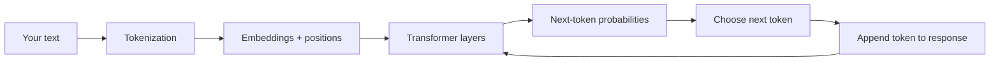

The model is not retrieving full sentences from a hidden database. It is **predicting one token at a time**, very quickly, based on patterns learned during training.

## Step 1: Text Becomes Tokens

Computers do not directly understand words. The first step is to split text into smaller pieces called **tokens**.

A token might be:

- a whole word
- part of a word
- punctuation
- or even a space-like pattern

For example:

| Original text | Possible tokens |
|---|---|
| `Large language models are useful.` | `Large`, ` language`, ` models`, ` are`, ` useful`, `.` |

This matters because the model works on tokens, not sentences or ideas.

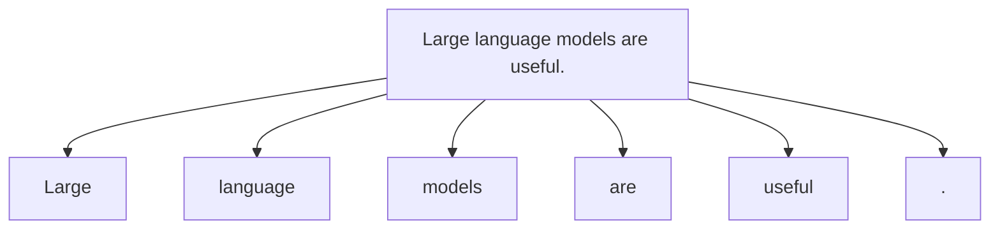

> An LLM never sees your input as plain language first. It sees a sequence of tokens that can be mapped to numbers.
{: .prompt-tip }

### Why tokens are numbers

All computation inside a neural network is arithmetic — additions, multiplications, and comparisons of numbers. There is no built-in way to do math on the text ` language` directly, so every token must be assigned an integer ID from the model's vocabulary. For example, the token ` language` might be assigned the ID `4221`.

Those integer IDs are then used to look up a learned vector (a row of floating-point numbers) that the model can actually compute with. The raw integer IDs themselves are just dictionary keys; the real numerical work starts in the embedding step.

### Why words are split into pieces

You might expect a simple word-by-word split. Two problems make that impractical:

1. **Vocabulary explosion.** English alone contains hundreds of thousands of words, and the model also needs to handle technical terms, names, multiple languages, and misspellings. A vocabulary that large would be slow and expensive to maintain.
2. **Unknown words.** A model trained on a fixed word list cannot handle any word that was not in that list. New words, rare surnames, and code snippets would all be silently broken.

Subword tokenization solves both problems. Common words stay intact as a single token. Rare or unseen words are decomposed into smaller pieces that *are* in the vocabulary.

For example, the word `unhappiness` might become `un` + `happiness`, and a rare word like `decarbonisation` might become `de` + `carbon` + `is` + `ation`. Each piece is a valid token, so the model can still process it — even if it has never seen the full word before.

| Word | Tokens (example) | Reason |
|---|---|---|
| `running` | `running` | common enough to be one token |
| `unhappiness` | `un`, `happiness` | assembled from known sub-pieces |
| `decarbonisation` | `de`, `carbon`, `is`, `ation` | rare word, broken into frequent parts |
| `ChatGPT3` | `Chat`, `G`, `PT`, `3` | mixed-case proper noun split at boundaries |

This is why LLMs sometimes appear to "miscount" letters in a word — they process tokens, which can each represent multiple characters, rather than individual characters. Character-level operations like counting or reversing a word require the model to reconstruct the original string from its tokens, which is an indirect and error-prone process.

## Step 2: Tokens Become Vectors

Once text is tokenized, each token is turned into a vector: a list of numbers that represents it in a mathematical space. This is called an **embedding**.

### Why vectors are needed

At the end of Step 1, each token is just an integer ID — a dictionary lookup key. The number `4221` by itself carries no meaning. The model cannot learn that `cat` and `kitten` are related just from their IDs being `2053` and `18789`.

An embedding converts each ID into a dense list of numbers (typically hundreds to thousands of floating-point values). These numbers are learned during training, and they encode *relationships*. After training, tokens with related meanings end up with embeddings that are geometrically close to each other in that high-dimensional space:

- `cat` and `kitten` will have similar vectors
- `France` and `Paris` will have a specific directional relationship similar to `Germany` → `Berlin`

This means the rest of the network can do meaningful arithmetic on the representations, rather than treating every token as an arbitrary unrelated symbol.

The model also adds **positional information** to each embedding, because word order matters.

Without position, these two sentences would look too similar:

- `The dog chased the cat`
- `The cat chased the dog`

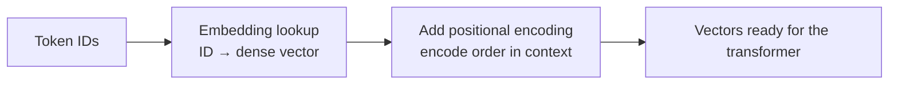

So at this stage, the model has not "understood" the sentence yet. It has only converted tokens into structured numerical input that preserves both meaning and position.

## Step 3: The Transformer Builds Meaning

The heart of a modern LLM is the **transformer**. A transformer is made of many repeated layers, and each layer helps the model refine its understanding of the relationships between tokens.

Each layer mainly does two things:

1. **Attention**: decide which earlier tokens matter most for the current token
2. **Feed-forward processing**: transform that information into richer internal features

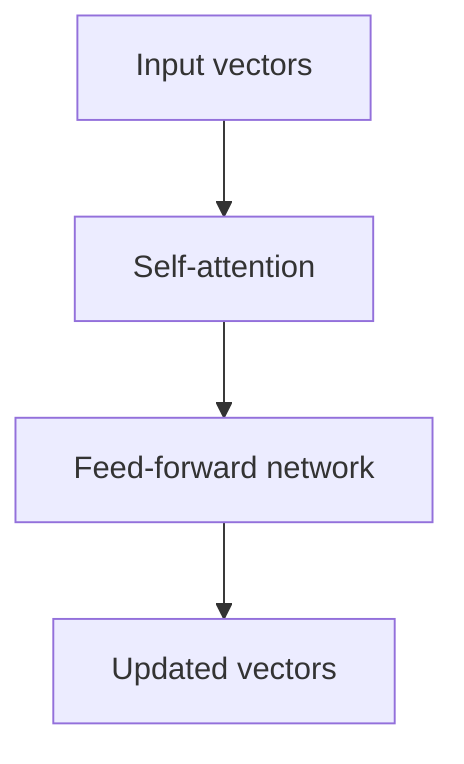

### What the feed-forward network actually does

After attention blends together information from across the context, the feed-forward network (FFN) processes each token's representation *independently* — as if it were asking "given everything attention just told me about this token, what should I know about it?"

During training, the FFN layers absorb a large amount of factual and linguistic knowledge. Researchers have found that factual associations (for example, knowing that Paris is the capital of France) are largely stored in the FFN weights. The attention mechanism finds contextual relationships between tokens; the FFN transforms each token's individual representation using those learned patterns and associations.

After one layer, the model has a slightly better representation. After many layers, it has a much richer one.

## Step 4: Attention Connects the Important Parts

Attention is the part that made transformers so powerful. It lets each token look at other tokens in the context and decide what matters.

Suppose the input is:

`The animal didn't cross the street because it was tired.`

When the model processes the token `it`, attention helps it connect `it` to `animal`, not `street`.

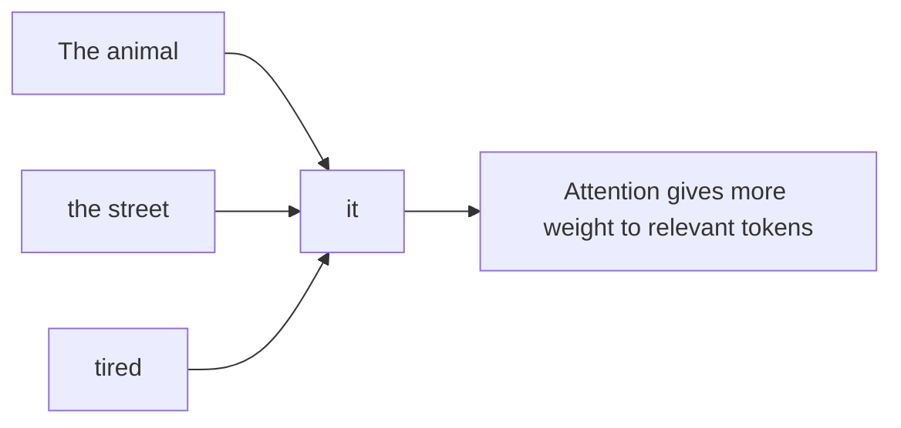

Inside the model, this is done using mathematical objects often called **queries, keys, and values**:

- **Query**: what this token is looking for
- **Key**: what each other token offers
- **Value**: the information carried by each token

The model compares queries and keys, creates attention scores, and uses those scores to combine values.

That sounds abstract, but the intuition is simple: **the model learns where to look before deciding what comes next**.

### A Practical Way to Think About Q, K, and V

Imagine you are reading this sentence:

`The animal didn't cross the street because it was tired.`

Now focus on the token `it`.

- The **query** from `it` is like asking: "Which earlier token tells me what `it` refers to?"
- The **keys** from other tokens are like labels saying: "I might be relevant for that question."
- The **values** are the actual information the model can pull in if a token is selected as useful.

| Token | Query / key intuition | Value intuition |
|---|---|---|
| `animal` | "Could be the thing that was tired" | carries the concept of the animal |
| `street` | "A noun, but less likely to be tired" | carries the concept of the street |
| `tired` | "Important clue about the relationship" | carries the state being described |

The model does not literally use English questions in its head, but this is a good practical mental model:

1. the current token asks what it needs
2. all earlier tokens advertise what they contain
3. attention scores decide who is most relevant
4. the selected information is blended back into the current token representation

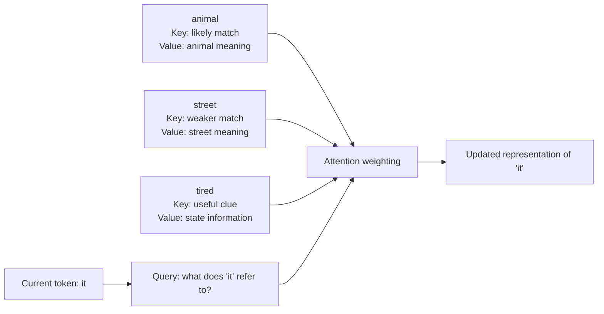

So **QKV is not three mysterious extra concepts**. It is the mechanism that lets a token search the context, score what matters, and pull back the useful information.

### Attention Heads Are Parallel Viewpoints

A transformer layer does not do attention just once. It usually does it many times in parallel using **attention heads**.

You can think of each head as a different lens over the same sentence:

- one head may focus on pronouns and references
- another may focus on nearby grammar
- another may focus on long-range relationships
- another may focus on important recent tokens

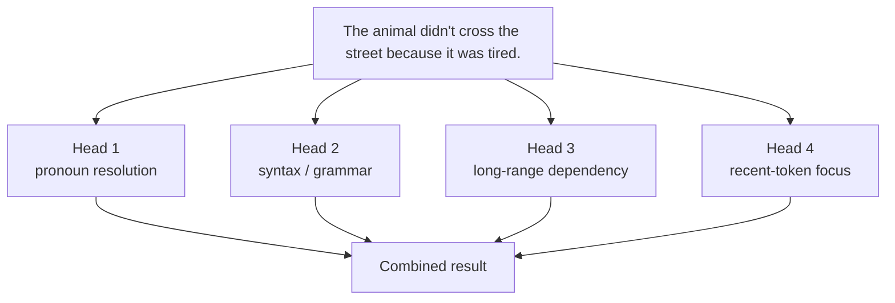

This matters because language has many patterns happening at once. A single attention map would be too limited. Multiple heads let the model look for several kinds of relationships in parallel before combining them.

## Step 5: Many Layers Build Richer Context

One transformer layer is useful. Dozens of layers are powerful.

### Why so many layers?

Each layer can only do a limited amount of work. It runs one round of attention and one feed-forward pass. That is enough to refine the representation slightly, but not enough to go from raw tokens all the way to deep semantic understanding in one shot.

Stacking many layers is how the model builds up complexity progressively. Think of it like a team of editors, each reading the document and adding annotations before passing it on. The first editor notices basic grammar. Later editors notice logical structure, tone, and implication.

Early layers often capture simpler patterns:

- punctuation
- nearby word relationships
- phrase boundaries

Later layers can capture more abstract patterns:

- topic
- syntax
- tone
- long-range dependencies

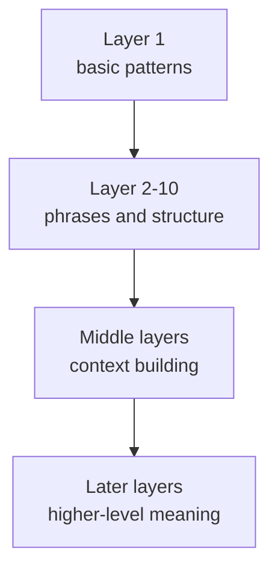

By the end of the stack, the model has a context-aware representation of the full prompt so far.

## Step 6: Context Is the Model's Working Memory

The word **context** means all the tokens the model can currently see and use when producing the next token.

That includes things like:

- your current prompt
- earlier parts of the conversation
- system instructions
- examples you included
- the tokens the model has already generated

If a fact is inside the context window, the model can attend to it. If it falls outside the window, it is effectively gone for that generation step.

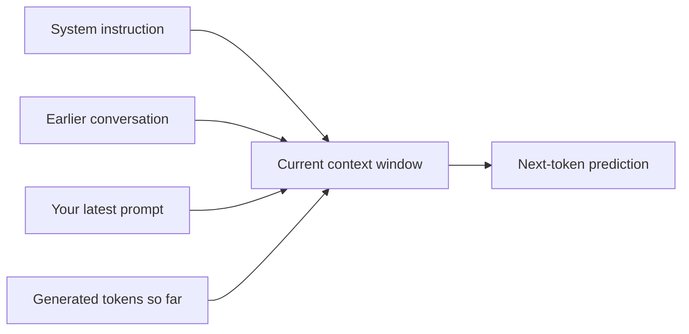

### Why Context Matters So Much

An LLM can look smart or confused depending on the quality of its context.

For example, compare these two prompts:

| Prompt style | Likely outcome |
|---|---|
| `Write a summary.` | generic answer because the task is underspecified |
| `Write a 3-bullet summary of this meeting for an executive audience. Focus on risks and deadlines.` | much better answer because the model has clearer context |

Context matters because it tells the model:

- what task you want
- what information is relevant
- what tone and format to use
- which facts should outweigh general world knowledge

In practice, this is why prompt quality matters so much. You are not just "asking a question." You are **constructing the working memory** the model will use.

### Context Placement Matters Too

Even when information is present, placement can affect how reliably the model uses it.

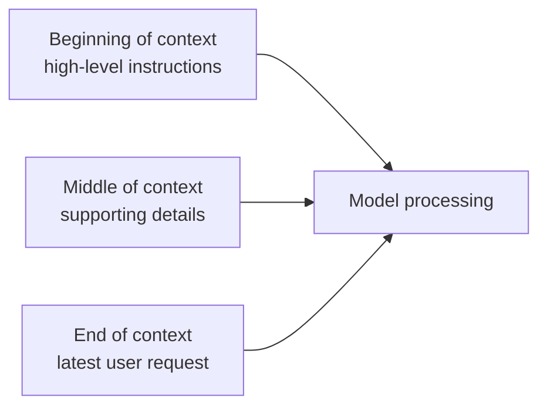

Practical implications:

- important instructions should be explicit
- critical facts should not be buried in irrelevant text
- long prompts can dilute what matters most
- losing key details from the context window can reduce answer quality fast

So when people say an LLM is "bad at context," they often mean one of two things:

1. the needed information was never included clearly
2. the information was included, but it was too far away, too noisy, or outside the context window

## Step 7: The Model Predicts the Next Token

Once the final layer finishes, the model produces a score for every possible token in its vocabulary. These scores are converted into probabilities.

For example, after:

`The capital of France is`

the model might assign probabilities like this:

| Candidate token | Example probability |
|---|---:|
| ` Paris` | 0.91 |
| ` Lyon` | 0.03 |
| ` London` | 0.01 |
| something else | 0.05 |

Then the system chooses a token. Sometimes it chooses the highest-probability token. Sometimes it samples more creatively from the top options.

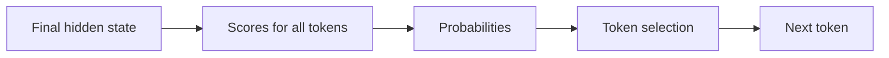

This is why LLMs are often described as **next-token predictors**.

## Step 8: Generation Is a Loop

The newly chosen token is added to the response, and then the whole process runs again with the updated context.

That means a sentence is generated token by token:

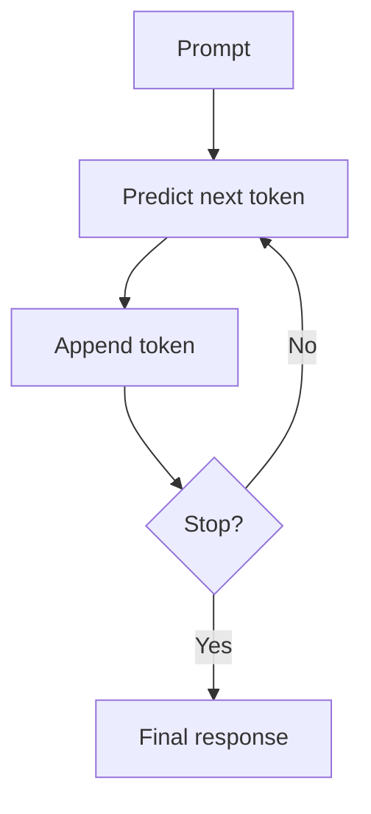

If the next token is ` Paris`, the model then predicts the next token after that. Maybe it adds a period. Maybe it continues with an explanation. The response grows one step at a time.

## Step 9: How the Model Learns During Training

So far we described **inference**, which is what happens when you use the model. But where did the model get these abilities?

During training, the model sees enormous amounts of text and repeatedly practices predicting the next token.

Example:

- Input: `The sky is`
- Correct next token: ` blue`

If the model predicts badly, its internal weights are adjusted slightly. This happens again and again across massive datasets.

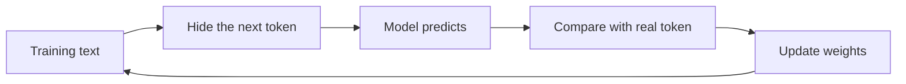

Over time, the model learns:

- grammar
- patterns of reasoning
- common facts
- writing styles
- relationships between concepts

It does **not** memorize everything perfectly, and it does not learn truth in the same way a human does. It learns statistical patterns from text.

## Step 10: Why LLMs Sometimes Fail

This step-by-step view also explains common limitations.

### Hallucinations

The model is always predicting plausible next tokens. If its learned patterns are weak or conflicting, it can produce text that sounds confident but is wrong.

### Context Window Limits

The model can only process a limited amount of text at once. If important information falls outside that window, performance can drop.

### No Built-In Ground Truth

An LLM does not automatically know whether a statement is verified, current, or safe. It only knows what token patterns are likely.

## A Simple Mental Model

If you want one sentence to remember, use this:

> An LLM is a system that turns text into tokens, tokens into vectors, vectors through transformer layers, and then predicts the next token repeatedly until a response is complete.

That mental model is not the whole story, but it is the right foundation.

## Final Thoughts

LLMs feel magical because they produce fluent language, but their workflow is structured:

1. tokenize
2. embed
3. attend with QKV
4. build context
5. transform
6. predict
7. repeat

Once you understand those steps, the black box becomes much less mysterious.

And from there, topics like prompt engineering, fine-tuning, RAG, tool use, and agent systems become much easier to understand because they all build on this same core loop.
