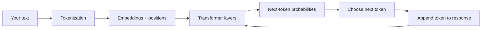
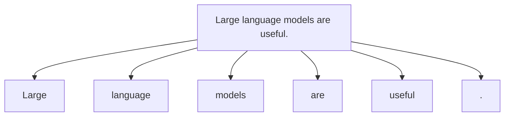
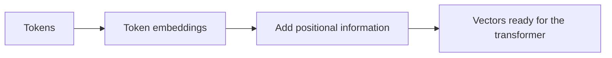
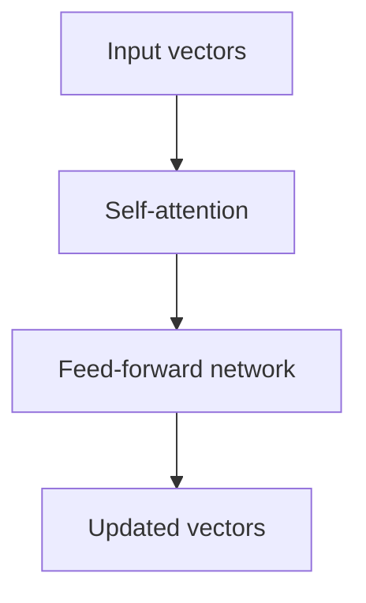
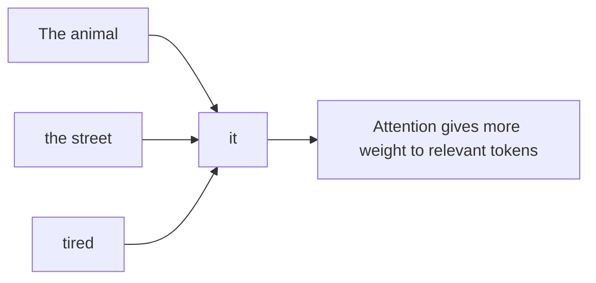
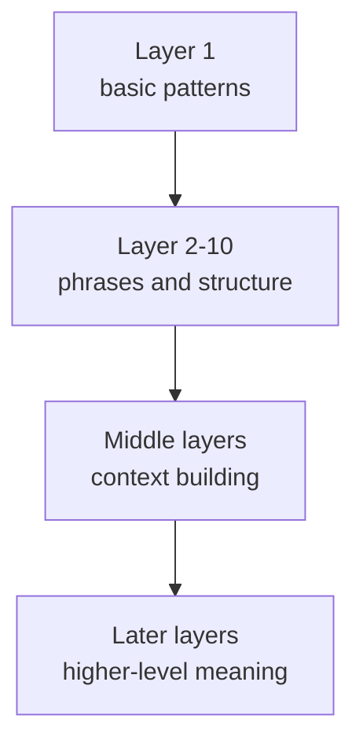
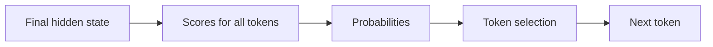
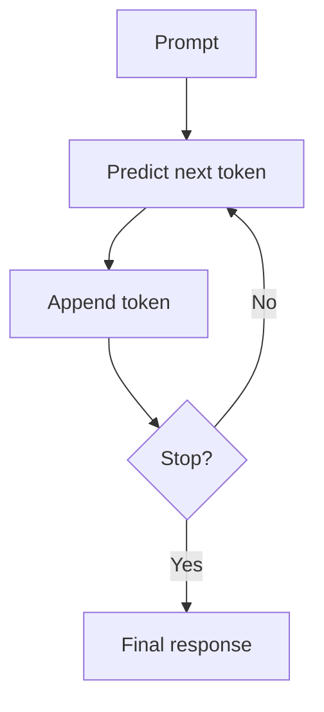
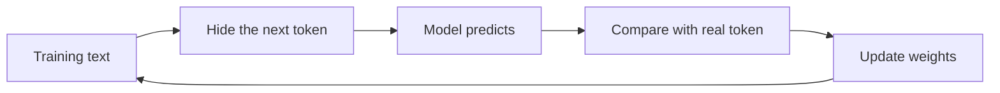

Large language models (LLMs) can feel mysterious at first. You type a question, and a polished answer appears a moment later. But under the hood, the process is a sequence of understandable steps.

This article breaks that process down visually and conceptually, so even if you're new to the topic, you can build a mental model for what is happening inside an LLM.

## The Big Picture

At the highest level, an LLM does something surprisingly simple:

1. It turns your text into tokens
2. It converts tokens into numbers
3. It processes those numbers through many transformer layers
4. It predicts the most likely next token
5. It repeats that process until it finishes the response

The model is not retrieving full sentences from a hidden database. It is **predicting one token at a time**, very quickly, based on patterns learned during training.

## Step 1: Text Becomes Tokens

Computers do not directly understand words. The first step is to split text into smaller pieces called **tokens**.

A token might be:

- a whole word
- part of a word
- punctuation
- or even a space-like pattern

For example:

| Original text | Possible tokens |
|---|---|
| `Large language models are useful.` | `Large`, ` language`, ` models`, ` are`, ` useful`, `.` |

This matters because the model works on tokens, not sentences or ideas.

> An LLM never sees your input as plain language first. It sees a sequence of tokens that can be mapped to numbers.
{: .prompt-tip }

## Step 2: Tokens Become Vectors

Once text is tokenized, each token is turned into a vector: a list of numbers that represents it in a mathematical space. This is called an **embedding**.

Tokens with related meanings often end up with embeddings that are closer together in that space. The model also adds **positional information**, because word order matters.

Without position, these two sentences would look too similar:

- `The dog chased the cat`
- `The cat chased the dog`

So at this stage, the model has not "understood" the sentence yet. It has only converted tokens into structured numerical input.

## Step 3: The Transformer Builds Meaning

The heart of a modern LLM is the **transformer**. A transformer is made of many repeated layers, and each layer helps the model refine its understanding of the relationships between tokens.

Each layer mainly does two things:

1. **Attention**: decide which earlier tokens matter most for the current token
2. **Feed-forward processing**: transform that information into richer internal features

After one layer, the model has a slightly better representation. After many layers, it has a much richer one.

## Step 4: Attention Connects the Important Parts

Attention is the part that made transformers so powerful. It lets each token look at other tokens in the context and decide what matters.

Suppose the input is:

`The animal didn't cross the street because it was tired.`

When the model processes the token `it`, attention helps it connect `it` to `animal`, not `street`.

Inside the model, this is done using mathematical objects often called **queries, keys, and values**:

- **Query**: what this token is looking for
- **Key**: what each other token offers
- **Value**: the information carried by each token

The model compares queries and keys, creates attention scores, and uses those scores to combine values.

That sounds abstract, but the intuition is simple: **the model learns where to look before deciding what comes next**.

## Step 5: Many Layers Build Richer Context

One transformer layer is useful. Dozens of layers are powerful.

Early layers often capture simpler patterns:

- punctuation
- nearby word relationships
- phrase boundaries

Later layers can capture more abstract patterns:

- topic
- syntax
- tone
- long-range dependencies

By the end of the stack, the model has a context-aware representation of the full prompt so far.

## Step 6: The Model Predicts the Next Token

Once the final layer finishes, the model produces a score for every possible token in its vocabulary. These scores are converted into probabilities.

For example, after:

`The capital of France is`

the model might assign probabilities like this:

| Candidate token | Example probability |
|---|---:|
| ` Paris` | 0.91 |
| ` Lyon` | 0.03 |
| ` London` | 0.01 |
| something else | 0.05 |

Then the system chooses a token. Sometimes it chooses the highest-probability token. Sometimes it samples more creatively from the top options.

This is why LLMs are often described as **next-token predictors**.

## Step 7: Generation Is a Loop

The newly chosen token is added to the response, and then the whole process runs again with the updated context.

That means a sentence is generated token by token:

If the next token is ` Paris`, the model then predicts the next token after that. Maybe it adds a period. Maybe it continues with an explanation. The response grows one step at a time.

## Step 8: How the Model Learns During Training

So far we described **inference**, which is what happens when you use the model. But where did the model get these abilities?

During training, the model sees enormous amounts of text and repeatedly practices predicting the next token.

Example:

- Input: `The sky is`
- Correct next token: ` blue`

If the model predicts badly, its internal weights are adjusted slightly. This happens again and again across massive datasets.

Over time, the model learns:

- grammar
- patterns of reasoning
- common facts
- writing styles
- relationships between concepts

It does **not** memorize everything perfectly, and it does not learn truth in the same way a human does. It learns statistical patterns from text.

## Step 9: Why LLMs Sometimes Fail

This step-by-step view also explains common limitations.

### Hallucinations

The model is always predicting plausible next tokens. If its learned patterns are weak or conflicting, it can produce text that sounds confident but is wrong.

### Context Window Limits

The model can only process a limited amount of text at once. If important information falls outside that window, performance can drop.

### No Built-In Ground Truth

An LLM does not automatically know whether a statement is verified, current, or safe. It only knows what token patterns are likely.

## A Simple Mental Model

If you want one sentence to remember, use this:

> An LLM is a system that turns text into tokens, tokens into vectors, vectors through transformer layers, and then predicts the next token repeatedly until a response is complete.

That mental model is not the whole story, but it is the right foundation.

## Final Thoughts

LLMs feel magical because they produce fluent language, but their workflow is structured:

1. tokenize
2. embed
3. attend
4. transform
5. predict
6. repeat

Once you understand those steps, the black box becomes much less mysterious.

And from there, topics like prompt engineering, fine-tuning, RAG, tool use, and agent systems become much easier to understand because they all build on this same core loop.
