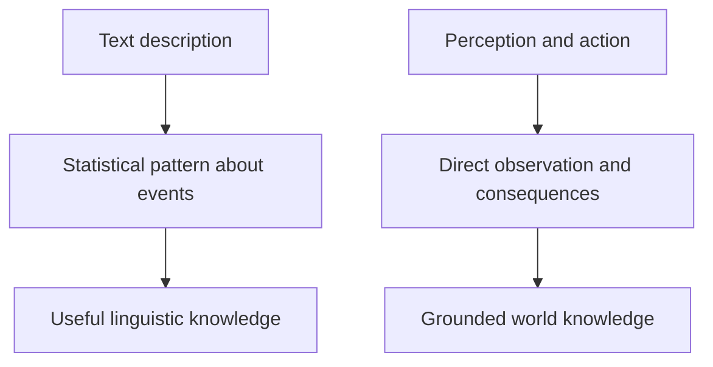
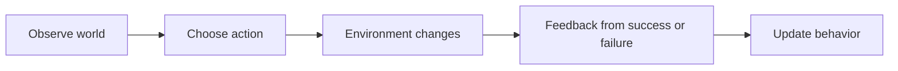

Large language models can become extremely good at language. They can summarize, translate, explain code, answer questions, and imitate many styles of writing. But there is a growing research discussion around a harder question:

**Can a system trained mainly on static text keep improving forever on world understanding, action, and consequences?**

Many researchers argue the answer is **no, not indefinitely**. Their claim is not that LLMs are useless, or that scaling stops helping. It is that **text-only training creates predictable strengths and predictable ceilings**. Language contains a great deal of information about the world, but it is still only an indirect record of experience. It is not the same as seeing, acting, and learning from consequences.

This article is a factual report on that discussion: why plateaus are expected, what "grounding" means, why interaction data matters, and why leading researchers and labs increasingly treat these questions seriously.

## The Big Picture

At a high level, the argument looks like this:

1. LLMs learn statistical structure from large text corpora
2. that gives them broad linguistic competence and some world knowledge
3. but text does not give direct perception, action, or feedback from consequences
4. so some capabilities improve more slowly or plateau
5. many researchers therefore argue that future systems need richer data, including multimodal and interactive experience

The important point is not that text teaches nothing about reality. It clearly does. The point is that **description is not the same as direct contact with the world**.

> A text-only LLM can learn many regularities about the world from language, but it does not literally see objects, manipulate them, or experience the consequences of its actions during pretraining.
{: .prompt-tip }

## What Researchers Mean by a "Plateau"

A plateau does **not** mean that progress fully stops.

In research discussions, it usually means something more specific:

- more scale keeps helping, but gains become smaller on some tasks
- performance remains brittle outside the distribution of training examples
- the system lacks the right kind of information for certain problems
- new amounts of compute do not solve the missing-data problem by themselves

This is why the debate is not simply "scaling works" versus "scaling fails." Both can be true in different domains:

- scaling often improves benchmark performance
- but some classes of capability may require **different data**, not just more of the same data

## Why Text-Only Models Become So Capable

It is important to start with what LLMs do well.

Research on scaling laws, including Kaplan et al. (2020), showed that language-model loss improves predictably with more parameters, data, and compute. The GPT-4 technical report also emphasized predictable scaling behavior across many evaluations.

That matters because language carries a huge amount of compressed human knowledge:

- facts about places, people, and institutions
- common explanations of physical processes
- descriptions of goals, plans, and mistakes
- examples of reasoning patterns
- human reports about what actions often lead to what outcomes

So text-only training can get a model surprisingly far. A model can learn that glass breaks, ice melts, and keys open doors because those patterns appear in language many times.

But this leads directly to the central limitation:

**the model learns these things as patterns in descriptions, not as direct sensorimotor experience.**

## Language Is About the World, But It Is Not the World

This distinction sits at the center of the grounding debate.

Bender and Koller (2020) argued that form alone does not guarantee meaning. Their core point was that a system trained only on linguistic form can learn impressive correlations without having access to the external referents that language is about.

That does not mean the model learns nothing. It means the model's relation to the world is **mediated by text**.

For example, a text-only model can encounter many sentences about:

- red balls rolling downhill
- cups falling off tables
- fire causing burns
- dogs chasing balls

But during pretraining, it does not:

- see the ball move
- perceive depth, friction, weight, or occlusion
- try to catch the cup before it falls
- learn from a failed action in a changing environment

Those differences matter because many useful concepts are tied to **perception, action, and feedback**.

## Why World Knowledge From Text Has Limits

Text is a rich but unusual source of supervision.

### 1. Text Is Biased Toward What Humans Write Down

Most human interaction with the world is never written. People do not document every object they look at, every failed reach, every balance adjustment, or every sensory cue they use.

That means text corpora are selective. They are dense in language and sparse in raw experience.

### 2. Text Usually Omits the Full State of the World

A sentence often leaves out details humans recover automatically from perception.

For example:

- object size
- exact geometry
- timing
- force
- distance
- visual ambiguity

Humans can often infer these because they have bodies, senses, and prior interaction with the world. A text-only model only gets whatever was explicitly or implicitly encoded in language.

### 3. Text Gives Weak Access to Causality

Language often reports outcomes after the fact. It is much less like running experiments.

A model may read that pushing a glass near the table edge can make it fall. But it is not repeatedly acting, observing, and updating from success or failure in a physical loop.

That matters because causal understanding is strengthened by intervention:

- try action
- observe result
- revise expectations

Static text mostly gives the model the final description, not the experiment.

## Why Interaction Changes What a System Can Learn

Once a system can perceive and act, the learning problem changes.

Instead of only reading about the world, the system can collect data like:

- what happens when an object is pushed
- which plans fail in cluttered environments
- how partial observations change with movement
- which actions repair or worsen a mistake

This kind of data is powerful because it links:

1. observation
2. action
3. consequence
4. correction

That loop is mostly absent in standard LLM pretraining.

A conventional LLM sees token sequences and learns to predict the next token. It does not usually:

- perform an action in the world
- receive physical feedback
- test a hypothesis through intervention
- accumulate embodied skills over repeated trials

This is one reason researchers such as Yann LeCun have argued that text alone is too limited a substrate for building robust world models.

## Why Plateaus Show Up on Some Tasks Faster Than Others

The limits are not uniform.

Text-only LLMs can continue improving on:

- writing quality
- summarization
- translation
- code completion
- many forms of question answering

But they are more likely to struggle, or improve more slowly, on tasks requiring:

- grounded spatial reasoning
- physical commonsense under novel conditions
- robust long-horizon planning in real environments
- reliable understanding of affordances
- knowing the consequences of actions in changing settings

That is because these tasks depend more heavily on information that text does not provide in a complete or first-hand way.

A useful way to think about it is this:

| Capability | Text-only data helps? | Direct world interaction helps? |
|---|---|---|
| Writing and style transfer | very strongly | only indirectly |
| Historical and institutional facts | strongly | rarely needed |
| Visual grounding | partially | strongly |
| Physical affordances | weakly to partially | strongly |
| Learning from trial and error | weakly | strongly |
| Action consequences in open environments | partially | strongly |

## The Debate Inside AI Research

This is now a well-known discussion inside the field, including among researchers at the biggest labs.

### Position 1: Scaling Continues To Unlock New Abilities

One position, associated with much of the scaling literature, is that larger models trained on more data continue to show new capabilities. Papers on scaling laws and frontier model reports support the view that there is still substantial room for progress through scale.

This side of the debate points to real evidence:

- larger models are more sample-efficient on many downstream tasks
- capability jumps do occur across model sizes
- language alone contains more useful world knowledge than many earlier researchers expected

This view is not irrational optimism. It is backed by results.

### Position 2: Text-Only Scaling Cannot Be the Whole Story

A different position argues that there are principled reasons to expect limits from text alone.

This view appears in different forms in work by Bender and Koller, LeCun, Mitchell, Marcus, and others. The details differ, but a shared theme is that **systems trained mainly on static text do not automatically acquire grounded meaning, causal models, or reliable action understanding just by becoming larger**.

The argument is also practical:

- internet text is finite
- text is not the same as experience
- many real tasks are interactive
- robust intelligence needs models of how the world changes under action

So the disagreement is not over whether LLMs are impressive. It is over **what kind of data is needed for the next major step**.

## Why Multimodal and Embodied Research Matters Here

The research direction of the last few years supports the idea that labs are taking this problem seriously.

Systems such as **Gato**, **PaLM-E**, and **RT-2** were important partly because they moved beyond pure text:

- Gato framed one model as a generalist policy across different modalities and tasks
- PaLM-E connected language with robot perception and embodied control
- RT-2 used vision-language-action training to transfer web knowledge into robotic behavior

These systems are still early and far from human-level general intelligence. But they matter because they reflect a broad research judgment:

**if you want a system to understand perception and action better, you should train it on perception and action data.**

## Why "No Idea What the World Looks Like" Is Mostly Right, but Needs Precision

The strongest version of the claim can be misleading if stated too loosely.

A text-only LLM is not blank about the visual world. It can often answer questions about:

- what bicycles look like
- where windows are usually placed on houses
- what happens when a cup is dropped

But that knowledge is second-hand. It comes from linguistic traces left by human observers.

So a more precise statement is:

> A text-only LLM does not have first-person perceptual access to the world. It can model many regularities described in text, but it does not literally see scenes, manipulate objects, or learn through direct consequences during ordinary pretraining.

That distinction is crucial because it separates **stored descriptions** from **grounded interaction**.

## Why Consequences Matter So Much

One of the biggest differences between language learning and world learning is the role of consequences.

In real environments:

- actions can fail
- states change over time
- information is incomplete
- timing matters
- mistakes create new constraints

A text corpus usually collapses all of that into a report.

For robust behavior, it often helps to learn from loops like:

1. predict what will happen
2. act
3. observe what actually happened
4. measure the error
5. update the model

That is why interactive data is so important in robotics, control, and reinforcement learning. It adds information that cannot be fully recovered from text alone.

## A Better Mental Model of the Limitation

The limitation is **not**:

- "LLMs know nothing"
- "text contains no world knowledge"
- "scaling never works"

The limitation is closer to this:

- LLMs are optimized for next-token prediction
- text gives indirect access to human knowledge about the world
- indirect access can support very strong performance
- but some capabilities depend on grounded observation and action
- so text-only systems should be expected to hit ceilings on certain classes of problems

That framing matches the evidence better than either extreme.

## Final Thoughts

The modern debate about LLM plateaus is really a debate about **data, not just architecture**.

Text gave AI an extraordinary leap because human language encodes enormous amounts of structure. But language is still a filtered record of reality, not reality itself.

That is why so many researchers treat grounding and interaction as central:

1. perception adds missing state information
2. action reveals affordances
3. consequences teach causality and error correction
4. multimodal data ties symbols to observations
5. interactive learning helps build stronger world models

So if you want one sentence to remember, use this:

> Text-only LLMs can learn a great deal about the world from language, but they are likely to plateau on some forms of understanding because they do not directly perceive, act in, or learn from the world they describe.

## Research References

- Jared Kaplan et al., [*Scaling Laws for Neural Language Models*](https://arxiv.org/abs/2001.08361), 2020
- OpenAI, [*GPT-4 Technical Report*](https://arxiv.org/abs/2303.08774), 2023
- Emily M. Bender and Alexander Koller, [*Climbing towards NLU: On Meaning, Form, and Understanding in the Age of Data*](https://aclanthology.org/2020.acl-main.463/), 2020
- Yann LeCun, [*A Path Towards Autonomous Machine Intelligence*](https://openreview.net/forum?id=BZ5a1r-kVsf), 2022
- Scott Reed et al., [*A Generalist Agent*](https://arxiv.org/abs/2205.06175), 2022
- Danny Driess et al., [*PaLM-E: An Embodied Multimodal Language Model*](https://arxiv.org/abs/2303.03378), 2023
- Anthony Brohan et al., [*RT-2: Vision-Language-Action Models Transfer Web Knowledge to Robotic Control*](https://arxiv.org/abs/2307.15818), 2023
