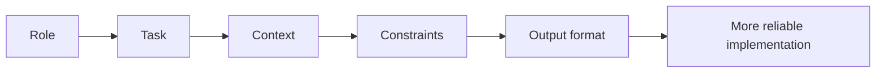
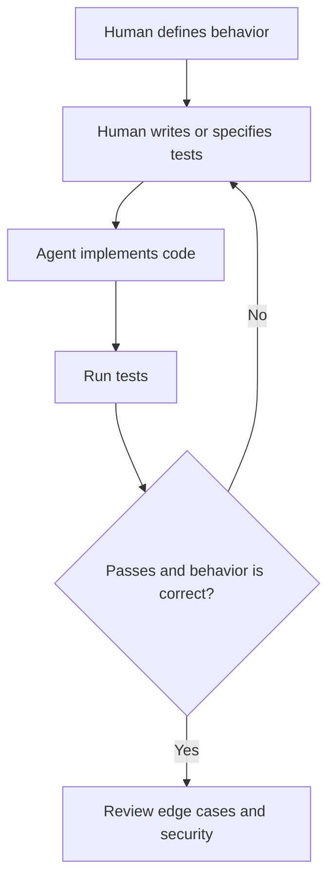
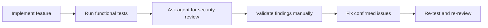

Agentic coding can make you dramatically faster, but only if you use agents with clear structure and strong validation. Without that, you often get code that looks correct, skips important edge cases, and quietly introduces security or maintenance problems.

The most reliable approach is not to treat the agent as an autonomous engineer. Treat it as a **high-speed implementation partner** operating inside a workflow that you control.

This article covers a practical approach to doing that well:

- use **RTCCO** to structure prompts clearly
- keep **test design human-led** with manual TDD
- use agents to expose **missing paths and edge cases**
- apply agents to **security review and validation** instead of blind trust

## Why Agentic Coding Fails Without Structure

A lot of poor agentic coding comes from underspecified requests like:

- `Build the feature`
- `Refactor this service`
- `Add tests`
- `Make it production ready`

These prompts sound clear to a human, but they leave too much open to interpretation. The agent fills the gaps with plausible assumptions. That is where drift starts:

- the wrong abstraction gets introduced
- important constraints are ignored
- happy paths are implemented while failure paths are skipped
- tests validate the generated code rather than the intended behavior

> The more freedom you give an agent, the more important your validation discipline becomes.
{: .prompt-tip }

## RTCCO: A Better Prompting Structure for Engineering Work

A simple way to improve agent output is to structure requests with **RTCCO**:

1. **Role**
2. **Task**
3. **Context**
4. **Constraints**
5. **Output format**

This gives the model a clearer operating frame and reduces ambiguity without making prompts unnecessarily long.



### 1. Role

Tell the model what perspective it should operate from.

Examples:

- `Act as a senior backend engineer`
- `Act as a security-minded reviewer`
- `Act as a staff engineer focused on maintainability`

Role affects trade-offs. A model asked to act like a rapid prototype builder may optimize for speed. A model asked to act like a production reviewer will usually be more conservative.

### 2. Task

State the exact change or outcome you want.

Good task statements are specific about the result:

- add support for retryable failures in the payment client
- create a blog article about agentic coding best practices
- refactor the parser so invalid input returns structured errors

Avoid vague task definitions that bundle too many goals together.

### 3. Context

Provide the information the model needs to make good decisions:

- relevant files or modules
- architecture constraints
- existing writing style or design patterns
- related PRs, issues, or documentation
- business rules and domain assumptions

Context is where most quality gains come from. If the agent does not know the local conventions, it will invent them.

### 4. Constraints

Constraints are what stop the model from taking shortcuts you do not want.

Useful engineering constraints include:

- do not change public APIs
- do not add new dependencies
- keep the change minimal
- preserve existing behavior
- do not write the tests; I will define them manually
- validate edge cases before finalizing

Constraints are not negative friction. They are safety rails.

### 5. Output Format

Specify how you want the response shaped.

Examples:

- return only a plan
- give me a checklist
- produce the code changes and then summarize risks
- list assumptions before implementation

This matters because the model often knows many ways to help, but you want one specific mode.

## A Practical RTCCO Example

For real engineering work, a prompt can be compact and still structured:

```text
Role: Act as a senior engineer reviewing a production change.
Task: Add support for partial retry in the API client.
Context: Use the existing retry policy and logging style in the repository. Keep the current public interface unchanged.
Constraints: Do not add dependencies. Do not write tests for me. I will define the tests manually. Call out edge cases and security risks.
Output format: First give a short plan, then implement, then summarize assumptions and remaining risks.
```

That is usually enough to produce much better output than a one-line request.

## Do Not Let the Agent Write the Tests First

One of the biggest mistakes in agentic coding is letting the same system both invent the implementation and define the tests that prove it is correct.

That creates a dangerous feedback loop:

1. the agent assumes how the feature should work
2. it writes code that matches that assumption
3. it writes tests that validate the same assumption
4. everything passes, but the wrong behavior is now locked in

This is why **manual TDD** is so valuable in agent workflows.

## Manual TDD for Agentic Coding

Manual TDD does not mean the agent is excluded from testing altogether. It means the **human defines the expected behavior and the validation boundaries first**.

Your job is to decide:

- what the correct behavior is
- which paths must be validated
- which edge cases are important
- what failure looks like
- what should never regress

Then the agent can help implement the production code against that test intent.



### What to Validate Manually

Before implementation, define checks for:

- the happy path
- failure paths
- boundary conditions
- missing input
- invalid input
- empty states
- unexpected ordering or timing
- permission and security boundaries

If you hand all of that to the agent without thinking it through yourself, you are outsourcing judgment instead of using leverage.

## Ask Edge-Case Questions Explicitly

Agents are useful for surfacing missing branches, but they usually need to be asked directly.

Good edge-case questioning looks like this:

- What path am I assuming always happens?
- Which failure branch is still untested?
- What happens when required data is missing?
- What happens when the input is present but malformed?
- What if the external system returns a partial success?
- Which branch would a user hit that the code currently ignores?
- What would break if the order of operations changed?

Two categories are especially important.

### 1. Missing Paths

These are branches that simply do not exist yet in the implementation or validation strategy.

Examples:

- null or empty input
- missing configuration
- timeout or retry exhaustion
- partial results
- unauthorized access
- stale or conflicting state

Missing paths often cause production issues because the happy path keeps working during development.

### 2. Suggestive Paths

These are paths the prompt or implementation quietly nudges the agent toward while hiding alternatives.

For example:

- a prompt implies that input is always valid
- the current code suggests success is the default outcome
- example data only shows well-formed requests
- existing tests overrepresent one branch

In these cases, ask the agent to challenge the framing:

- Which assumptions in this request are probably too optimistic?
- Which alternative flows are implied but not handled?
- If this feature were abused, misused, or called incorrectly, what would happen?

That kind of questioning turns the agent into a gap finder instead of just a code generator.

## Use Agents to Strengthen Security, Not Just Speed Up Delivery

Security is another area where agents can help a lot, as long as they are used for structured review instead of blind trust.

A useful pattern is to ask the agent to review a change from an attacker or defender perspective after the implementation exists.

### Security Questions Agents Are Good At

Ask the agent to inspect for issues like:

- input validation gaps
- injection risks
- missing authorization checks
- insecure defaults
- excessive data exposure
- unsafe deserialization or parsing
- secrets handling mistakes
- path traversal and file access issues
- SSRF, XSS, or CSRF exposure depending on the stack

This works especially well when the prompt is focused:

```text
Review this change as a security-minded engineer. Identify trust boundaries, user-controlled input, missing validation, and any path that could lead to data leakage or unauthorized access.
```

## A Practical Security Validation Loop

A strong agentic workflow treats security as a repeatable validation step.



The important part is **validate findings manually**. Agents are good at spotting suspicious areas, but they can still produce false positives or miss stack-specific issues.

## Security Guardrails for Agentic Coding

Here are practical guardrails worth applying consistently:

1. **Treat all external input as untrusted**
2. **Ask the agent to identify trust boundaries explicitly**
3. **Review authentication and authorization separately**
4. **Validate outputs, not just inputs**
5. **Check logs, errors, and analytics for data leakage**
6. **Test abuse cases, not just normal use cases**
7. **Re-run validation after fixes**

A secure application is not one that passed a single scan. It is one that survived repeated questioning from multiple angles.

## A Good Default Workflow for Agentic Coding

If you want one practical workflow to apply across most tasks, use this:

1. define the behavior yourself
2. prompt with **RTCCO**
3. keep constraints explicit
4. define tests manually before trusting the implementation
5. ask for missing and suggestive edge cases
6. run a dedicated security review prompt
7. validate everything with real tests and manual judgment

This keeps the human responsible for correctness while letting the agent accelerate execution.

## Final Thoughts

The best agentic coding setups are not fully autonomous. They are **well-directed, heavily validated, and intentionally constrained**.

RTCCO improves prompt quality.
Manual TDD protects correctness.
Edge-case questioning improves robustness.
Security review keeps speed from turning into risk.

Used that way, agents do not replace engineering judgment. They amplify it.
