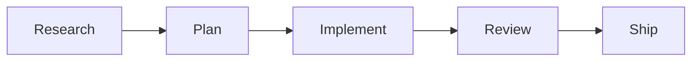
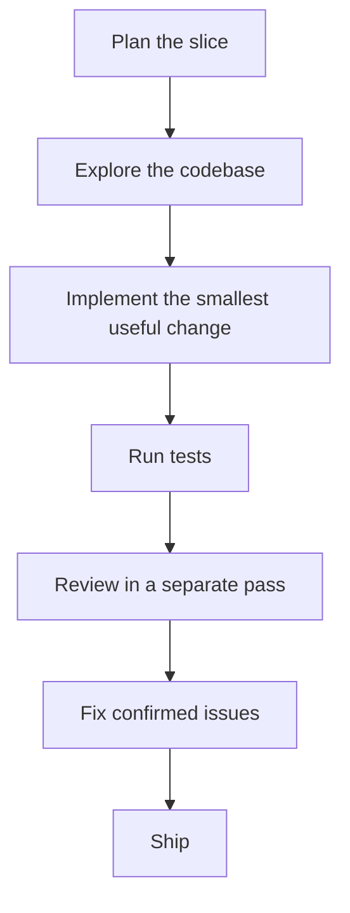

Claude Code can feel almost magical on the right task. It reads code fast, explores unfamiliar systems well, and helps you move from idea to implementation much quicker than a normal editor workflow.

But the difference between a great Claude Code session and a frustrating one is usually not the model. It is the workflow.

When people get poor results, the pattern is often the same:

- the task is too broad
- the context is too messy
- the instructions are too long
- the validation loop is too weak

The best guidance on this is now coming from a mix of **Anthropic's own Claude Code materials**, **plugins published in the official repository**, and **experienced practitioners sharing what actually works in production**.

This article pulls those ideas together into a practical playbook:

- when to start with plan mode
- how to manage context before results degrade
- how to structure `CLAUDE.md` without turning it into junk context
- when to use subagents instead of one giant session
- how to review code with separate passes instead of blind trust

## The Big Idea: Claude Code Works Best as a Controlled System

One of the most useful signals comes from Anthropic's own Claude Code plugins.

The official **feature development** workflow is not "ask once and hope." It is explicitly staged:

1. discovery
2. codebase exploration
3. clarifying questions
4. architecture design
5. implementation
6. quality review
7. summary

That matters because it shows how the Claude Code team itself thinks about good usage. The default pattern is **research first, then plan, then implement, then review**.

> The fastest way to make Claude Code worse is to make one session responsible for everything at once.
{: .prompt-tip }

## The Numbers Worth Remembering

If you only remember a few numbers from the research, make it these:

- Anthropic's feature workflow recommends **2 to 3 exploration agents** in parallel
- the same workflow recommends **2 to 3 architecture agents** before implementation
- Anthropic's official review plugin uses **4 review agents**
- that plugin filters findings below an **80 confidence score**
- Boris Cherny recommends keeping `CLAUDE.md` to roughly **under 200 lines**
- experienced users try to keep important work **under ~30% context**
- degradation is often reported around **~40% context**
- on 1M context models, context rot has been reported around **~300k to 400k tokens**

These are not random trivia. They are useful because they tell you how to scope the work, how much context to tolerate, and how much review redundancy serious workflows actually use.

## 1. Start with Plan Mode More Often Than You Think

Boris Cherny, one of the main people behind Claude Code, has given a very simple piece of advice:

**start with plan mode**.

That sounds minor, but it fixes a common failure mode. Many people open Claude Code and immediately ask for implementation. The problem is that implementation starts before the task has been constrained properly.

Plan mode is useful when:

- the task touches multiple modules
- you are not sure where the logic lives yet
- the requirement sounds simple but probably hides edge cases
- you need to compare two or three implementation approaches

It is usually unnecessary when:

- the change is isolated to one file
- the bug is already understood
- the implementation path is obvious

### A Practical Example

Suppose you want to add retry logic to a payment client.

Bad first request:

- `add retry support to the payment client`

Better Claude Code workflow:

1. ask for a plan
2. ask it to identify the relevant files
3. ask what failure modes need different handling
4. only then implement

This sounds slower, but in practice it is often faster because you avoid the rewrite after the first wrong abstraction.

## 2. Keep the Task Small Enough to Stay Intelligent

One of the most useful practitioner observations around Claude Code is that **context quality degrades before the context window is technically full**.

In community research collected from Anthropic practitioners:

- **results start degrading around ~40% context usage**
- experienced users try to keep important work **below ~30%**
- on 1M context models, **context rot has been reported around ~300k to 400k tokens**

That does not mean Claude suddenly stops working at 41%. It means reasoning quality gets less reliable long before the session is fully exhausted.

So the practical rule is simple:

- use one session for one real problem
- when the task changes, start a new session
- when the history is getting noisy, compact or clear deliberately

### A Better Way to Think About Session Size

Instead of asking:

- `Can Claude Code handle this whole migration?`

Ask:

- `What is the smallest slice that still produces a useful result?`

For example:

- not "refactor the whole auth system"
- but "move token refresh into a separate service without changing public behavior"

- not "fix all flaky tests"
- but "stabilize the checkout timeout test and explain the root cause"

- not "rewrite the analytics pipeline"
- but "replace the duplicate event normalization step in the ingestion path"

Small slices are not only easier to validate. They also protect the session from turning into a polluted mix of dead ends, corrections, and half-finished ideas.

## 3. Use `/rewind`, `/compact`, and `/clear` Intentionally

Claude Code gives you several ways to recover a session, but they are not interchangeable.

### `/rewind`

Use this when Claude went down the wrong path and you want to remove that branch from the conversation history.

This is often better than adding more correction prompts, because correction prompts keep the bad path in context.

### `/compact`

Use this when the task is still the same, but you need a smaller working history.

This helps preserve momentum, but it is still a lossy summary. Good for continuation. Not ideal for high-risk decisions.

### `/clear`

Use this when the next step is meaningfully different from the previous one and you want a clean start.

If you just finished implementation and now want a strict review pass, a clean session is often better than carrying all the implementation chatter forward.

## 4. Keep `CLAUDE.md` Short Enough to Be Useful

Another repeated best practice from Boris Cherny and the official memory guidance is to keep `CLAUDE.md` **under roughly 200 lines per file**.

That is a good rule because instruction files fail in two opposite ways:

- too short, and they do not contain enough local guidance
- too long, and they become bloated, ignored, or diluted

What belongs in `CLAUDE.md`:

- repo-specific commands
- testing expectations
- code review rules
- naming or architecture constraints
- decision-making rules that apply repeatedly

What usually does **not** belong there:

- long prose explanations
- one-off task notes
- large style guides duplicated from elsewhere
- instructions that should really be enforced by tooling

### A Practical Structure

A strong `CLAUDE.md` is usually closer to a sharp operating manual than a wiki page.

For example:

1. how to build and test
2. what not to change casually
3. required validation steps
4. project-specific conventions
5. important architecture boundaries

If the file becomes a 500-line catch-all, Claude Code has more to read but less signal to follow.

## 5. Use Subagents for Isolation, Not Just Speed

One of the most important workflow upgrades is learning when **not** to keep everything in the same context.

Subagents are useful because they isolate exploratory work.

That means:

- one subagent can trace the existing implementation
- another can inspect tests
- another can review a security-sensitive path

Then the parent session only gets back the conclusions that matter.

This matches how Anthropic's own tooling works. The official feature and review workflows launch **multiple agents in parallel** for exploration and review instead of depending on a single all-knowing pass.

### A Real-World Pattern

If a task touches 12 files across API, background jobs, and UI:

- do not ask one session to reason about all 12 files at once
- use one pass to map the surface area
- send focused subagents after the risky areas
- bring back summaries, not every dead end

This keeps your main thread cleaner and usually improves judgment on the final decision.

## 6. Review with a Separate Pass

One of the best concrete signals from Anthropic's official `code-review` plugin is that it uses **multiple review agents in parallel** and only surfaces issues above an **80 confidence threshold**.

That alone tells you something important:

- one pass is not enough
- raw findings need filtering
- review works better when separated from implementation

### What This Means in Practice

Do not finish coding and immediately trust the same conversational thread to tell you whether the result is good.

Instead:

1. implement
2. run tests
3. start a review pass
4. ask for bugs, edge cases, and security issues explicitly

Good review prompts are narrow:

- review this diff for correctness regressions
- find missing failure handling
- check whether user-controlled input crosses trust boundaries unsafely
- list the two or three issues you are most confident are real

That is much better than:

- `review my code`

## 7. Prefer Vertical Slices Over Giant Refactors

Another strong idea from the Claude Code community is to avoid asking for large horizontal phases when you can ship a **vertical slice** instead.

Horizontal phase:

- database first
- then service layer
- then frontend
- then tests

Vertical slice:

- one thin end-to-end improvement across storage, backend, UI, and validation

Vertical slices work better with Claude Code because they create earlier feedback.

Instead of waiting until the end to find out the whole plan was wrong, you can validate one useful path immediately.

### Example

If you are improving a customer onboarding flow, a vertical slice might be:

- add one new field
- validate it on submit
- persist it correctly
- render it in the review screen
- add the test for that path

That gives you a complete result quickly and reduces the blast radius if the direction changes.

## 8. Claude Code Is Better at Verification When You Ask for Proof

Another good practitioner pattern is to ask Claude Code to **prove** that a change works instead of merely claiming it works.

Useful prompts:

- prove this change handles the failure path
- compare this branch against main and tell me what could break
- grill me on this implementation before I open the PR

This pushes the session away from optimistic summaries and toward evidence.

In practice, that usually means:

- naming the exact command to run
- identifying missing tests
- calling out assumptions
- highlighting branches that were not exercised

The quality jump here is often large, because many weak completions sound finished long before they are actually verified.

## 9. A Good Default Workflow for Claude Code

If you want one practical workflow that works for most engineering tasks, use this:

1. start with plan mode for anything non-trivial
2. keep the task scoped to one real problem
3. watch context growth before it becomes a quality issue
4. use `CLAUDE.md` for high-signal repository rules only
5. use subagents to isolate research and risky analysis
6. implement in small vertical slices
7. review in a fresh pass
8. ask for proof, not reassurance

## Final Thoughts

The best way to use Claude Code is not to turn it into an all-purpose autopilot.

It is to use it as a **fast, context-sensitive engineering partner inside a workflow with clear boundaries**.

That means:

- plan before implementation
- manage context before it degrades
- keep instructions short and sharp
- isolate research when needed
- separate implementation from review
- ask for evidence before you trust the output

Used that way, Claude Code is not just faster. It is much more reliable.

## Sources

- [Anthropic Claude Code - Overview](https://code.claude.com/docs/en/overview)
- [Anthropic Claude Code - Common Workflows](https://code.claude.com/docs/en/common-workflows)
- [Anthropic Claude Code - Memory](https://code.claude.com/docs/en/memory)
- [Anthropic Claude Code official repository - feature-dev workflow](https://github.com/anthropics/claude-code/blob/main/plugins/feature-dev/commands/feature-dev.md)
- [Anthropic Claude Code official repository - code-review plugin](https://github.com/anthropics/claude-code/blob/main/plugins/code-review/README.md)
- [Shan Rai Shan - Claude Code Best Practice](https://github.com/shanraisshan/claude-code-best-practice)
- [Dex Horthy - Everything We Got Wrong About Research, Plan, Implement](https://youtu.be/YwZR6tc7qYg?t=1541)
- [Boris Cherny - Building Claude Code](https://youtu.be/julbw1JuAz0)
