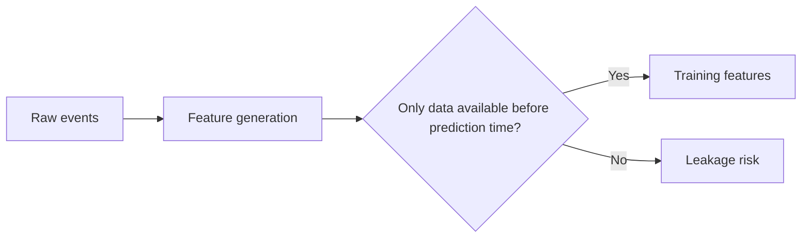
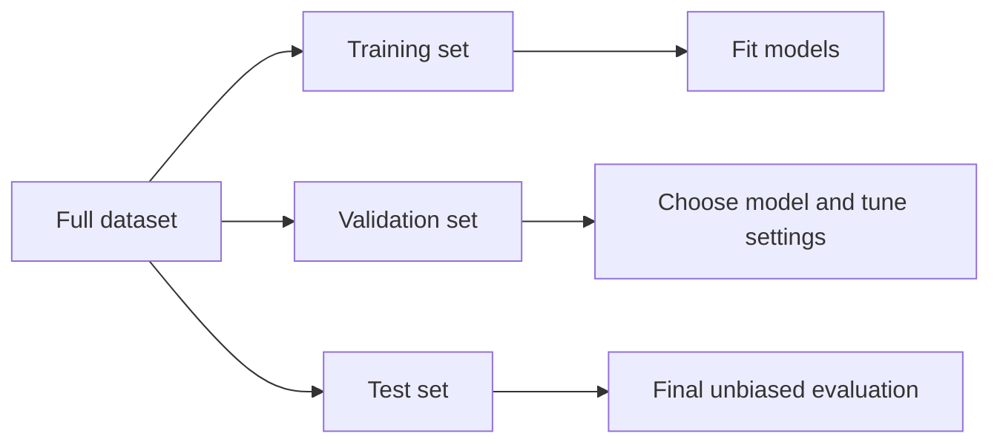
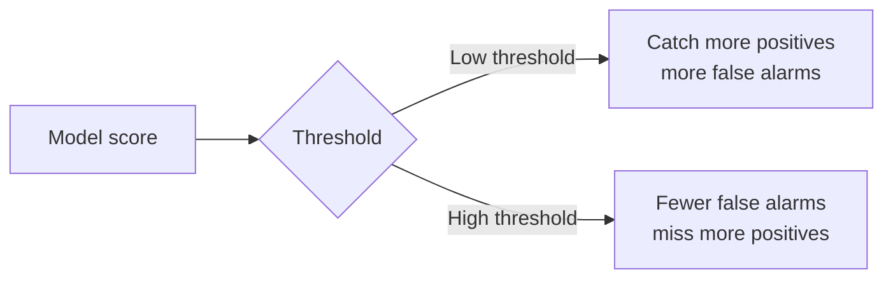
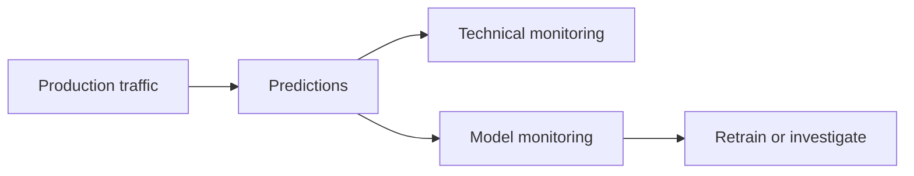

If you are an engineer who has not worked deeply with data science before, the field can seem vague: lots of models, lots of statistics, and lots of charts that look convincing even when they are not.

In practice, data science is much simpler to reason about when you treat it like an engineering workflow:

1. start from a decision
2. collect and understand the data
3. build a simple baseline
4. measure the right thing
5. deploy carefully
6. monitor reality after launch

This article walks through that full cycle with concrete examples and the practical best practices that matter most.

## What Data Science Actually Is

Data science is the discipline of using data to answer questions, support decisions, and build systems that make useful predictions.

It overlaps with several neighboring fields, but they are not identical:

- **analytics** focuses on understanding what happened
- **statistics** focuses on inference, uncertainty, and reasoning from data
- **machine learning** focuses on learning patterns from data to make predictions or decisions
- **data science** usually covers the full workflow from framing the question to evaluating the result in production

### Common Project Types

Most real projects fall into a few familiar buckets:

- **descriptive analytics**: what happened last week?
- **forecasting**: how many orders will we get next month?
- **classification**: is this email spam or not spam?
- **regression**: what delivery time should we expect?
- **ranking**: which items should appear first?
- **recommendation**: what should the user see next?
- **anomaly detection**: which events look suspicious?

### How Data Science Differs from Normal Software Engineering

Software engineering often starts with deterministic rules: given the same input, the program should behave the same way.

Data science is different because the system is often probabilistic:

- inputs may be incomplete or noisy
- labels may be imperfect
- the model may be right 92% of the time instead of 100%
- the real world may change after deployment

That means data science work still needs engineering discipline, but it also needs measurement, uncertainty handling, and ongoing monitoring.

## Start with the Decision, Not the Model

One of the biggest failure modes in data science is starting with:

- `Let's use machine learning`

instead of:

- `What decision are we trying to improve?`

The right starting point is a business or product decision.

### Example: Fraud Review

A vague request:

- `Build a fraud model`

A better problem statement:

- `Predict which card transactions should be sent to manual review so we reduce fraud losses without overwhelming the review team`

That version forces the important questions into the open:

- what is the **target variable**?
- what inputs are available at prediction time?
- what counts as success?
- what is the cost of a false positive?
- what is the cost of a false negative?
- how fast must the decision be made?

> In data science, a metric only makes sense in the context of a real decision.
{: .prompt-tip }

### Frame the Problem Explicitly

Before modeling, define:

1. **target**: what exactly are we predicting?
2. **inputs**: which features are available at decision time?
3. **scope**: which users, regions, products, or time periods are included?
4. **constraints**: latency, cost, explainability, compliance, review capacity
5. **success criteria**: how will we know the system is actually better?

You should also clarify what kind of learning problem you have:

- **supervised learning**: you have labeled examples
- **unsupervised learning**: you are looking for structure without labels
- **reinforcement learning**: actions affect future rewards

Most engineering teams start with supervised problems because they map most directly to product decisions.

## Understand the Data Before You Touch a Model

The next step is not tuning algorithms. It is understanding the data source and whether it matches reality.

Typical sources include:

- application databases
- APIs
- logs and telemetry
- product events
- uploaded files
- third-party data feeds
- human-generated labels

For each source, ask:

- what does each row represent?
- what are the units?
- how fresh is the data?
- how complete is the coverage?
- who owns the data definition?
- how often is it wrong or delayed?

### Exploratory Data Analysis: What to Check First

Exploratory data analysis does not need to be fancy. The first pass should answer simple questions:

- how many rows do we have?
- what is the class balance?
- which columns are missing often?
- which values are impossible or inconsistent?
- are there major outliers?
- are any features leaking future information?

### Example: Churn Prediction

Suppose you are predicting whether a customer will cancel next month.

Potential leakage:

- including a feature like `account_closed_at`
- including support status that is only updated after retention outreach
- aggregating events that happened after the prediction cutoff

These features make offline metrics look great while making the model useless in production.

## Data Preparation: Make the Pipeline Reproducible

Once you understand the data, prepare it in a way that is consistent and reproducible.

This usually includes:

- removing duplicates
- fixing invalid records
- handling missing values
- encoding categorical variables
- scaling numeric variables when needed
- building features that summarize useful behavior

Simple, stable features often beat clever but brittle ones.

Examples:

- number of failed login attempts in the last 24 hours
- average order value over the last 30 days
- days since last activity
- count of support tickets in the past week

These are usually more durable than highly complex derived features that are hard to explain or maintain.

### Best Practices for Preparation

- keep all transformations in code, not ad hoc notebook cells
- version the data extraction and feature logic
- document assumptions about missing values and defaults
- make sure training-time and serving-time transformations are identical

That last point matters because **training-serving skew** is a classic failure mode: the model is trained on one feature pipeline and served with a slightly different one.

## Split the Data Correctly

A core discipline in machine learning is separating data for training, validation, and testing.

- **training set**: used to learn model parameters
- **validation set**: used to compare models and tune hyperparameters
- **test set**: used once at the end to estimate generalization

### Why the Test Set Must Stay Untouched

If you repeatedly tune against the test set, it stops being a true test set. You are effectively overfitting to it.

That is why the test set should be saved for the final evaluation only.

### Split Carefully for Time-Based Data

For time series or behavior prediction problems, random splits can be misleading.

Example:

- training on October data and validating on September data is unrealistic

Instead, use a time-aware split:

- train on older data
- validate on more recent data
- test on the newest holdout period

Also make sure duplicates or near-duplicates do not appear across splits.

## Start with a Baseline Before Complex Models

A strong baseline keeps the project honest.

Good baselines include:

- majority class prediction
- simple rules
- historical average
- linear regression
- logistic regression

### Example: Delivery Time Prediction

Before trying gradient boosting or neural networks, compare against:

- average delivery time by route
- average delivery time by route and weekday
- a simple linear model using distance and order size

If a sophisticated model does not beat those baselines by enough to matter, the extra complexity may not be justified.

This is especially important for engineers, because operational cost matters:

- harder debugging
- harder deployment
- harder monitoring
- less explainability

## Model Training: Learn the Core Trade-offs

A useful first model tells you whether there is meaningful signal in the data at all.

While training, you should understand a few basic concepts.

### Parameters vs Hyperparameters

- **parameters** are learned from data, like model weights
- **hyperparameters** are choices you set, like tree depth or regularization strength

Hyperparameters should be tuned on the validation set, not the test set.

### Bias, Variance, Underfitting, and Overfitting

- **high bias / underfitting**: the model is too simple and misses real patterns
- **high variance / overfitting**: the model memorizes noise and fails on unseen data

A common pattern:

- low training error
- much worse validation error

That usually signals overfitting.

When data is limited, cross-validation can help estimate performance more reliably, as long as the setup matches the real prediction scenario.

## Measure Results with Metrics That Match the Decision

Not all errors cost the same, so not all metrics are equally useful.

### Regression Metrics

For numeric prediction tasks:

- **MAE**: average absolute error; easy to explain
- **RMSE**: penalizes larger errors more strongly
- **R-squared**: how much variance the model explains relative to a baseline

Example:

- if you predict delivery time, MAE may be more intuitive because you can say the model is off by about 8 minutes on average

### Classification Metrics

For yes/no or multi-class prediction:

- **accuracy**: overall fraction correct
- **precision**: when the model predicts positive, how often is it correct?
- **recall**: of all real positives, how many did the model find?
- **specificity**: of all real negatives, how many did it reject correctly?
- **F1**: balance of precision and recall
- **ROC-AUC**: ranking quality across thresholds
- **PR-AUC**: often more useful for rare positive classes

Accuracy alone is often misleading.

## Confusion Matrix: The Foundation for Classification Metrics

A confusion matrix is the clearest way to understand binary classification outcomes.

|               | Actual positive | Actual negative |
|---|---:|---:|
| Predicted positive | True positive (TP) | False positive (FP) |
| Predicted negative | False negative (FN) | True negative (TN) |

Start by treating it as a table of counts.

### Example

Imagine a fraud model evaluated on 1,000 transactions:

- TP = 70
- FP = 50
- TN = 850
- FN = 30

From those counts:

- precision = 70 / (70 + 50) = 0.58
- recall = 70 / (70 + 30) = 0.70
- accuracy = (70 + 850) / 1000 = 0.92

At first glance, 92% accuracy looks excellent. But the model still misses 30 fraudulent transactions and sends 50 legitimate ones to review. Whether that is acceptable depends on business cost.

## Precision, Recall, and F1 in Plain Language

These three metrics come up constantly because they capture the trade-off between catching positives and avoiding false alarms.

- **precision** answers: when we flag something, how often are we right?
- **recall** answers: when something is truly positive, how often do we catch it?
- **F1** combines both when you want one summary number

### Practical Interpretation

For fraud review:

- high precision means analysts waste less time
- high recall means fewer fraudulent transactions slip through

For disease screening:

- false negatives may be much worse than false positives
- recall often matters more than raw precision

That is why the right metric depends on the decision and the cost of mistakes.

## Thresholds Create Trade-offs

Many classifiers output probabilities or scores, not final yes/no labels.

A threshold converts that score into an action.

Example:

- score >= 0.50 means predict positive

But 0.50 is not a law of nature. It is just a decision threshold.

### What Changes When You Move the Threshold

- lower threshold -> more positives predicted -> higher recall, lower precision
- higher threshold -> fewer positives predicted -> lower recall, higher precision

Threshold selection should reflect:

- business cost
- user impact
- manual review capacity
- compliance requirements

## Imbalanced Data: Why Accuracy Can Lie

In many systems, the positive class is rare.

Examples:

- fraud
- account compromise
- production incidents
- manufacturing defects

If only 1% of cases are positive, a model that always predicts negative gets 99% accuracy and is still useless.

### Better Practices for Imbalanced Problems

- report class distribution with the metrics
- focus on precision, recall, PR-AUC, and cost-sensitive evaluation
- consider class weighting or resampling when appropriate
- evaluate on data that reflects production prevalence

## Error Analysis Is Model Debugging

Good teams do not stop at one metric table. They inspect mistakes directly.

Review:

- false positives
- false negatives
- unexpected slices of weak performance

Then break the results down by:

- geography
- device type
- language
- customer segment
- traffic source
- time period

This often reveals the real issue:

- bad labels
- data drift
- missing features
- leakage
- inconsistent annotation
- a subpopulation the model never learned well

### Example

A churn model looks strong overall, but recall is poor for new customers in one country because those users have fewer historical events. That may point to a missing feature strategy, not a need for a fancier model.

## Deployment: Make Inference Behave Like Training

A model is only useful if it can run reliably inside a real product or workflow.

Two common serving patterns are:

- **batch inference**: run predictions periodically for many records at once
- **real-time inference**: score a request during a user or system action

### What Engineers Should Define Before Launch

- latency budget
- throughput expectations
- retry and fallback behavior
- observability
- rollback strategy
- versioning for model, code, features, and data

Bundle preprocessing and model logic together when possible so the online system uses the same transformations the offline training job used.

## Monitoring: Production Is Part of the Lifecycle

A deployed model is not finished. It is a system that can decay.

Monitor both technical and model health.

### Technical Health

- latency
- error rate
- throughput
- dependency failures

### Model Health

- prediction distribution
- feature drift
- label drift
- calibration
- business KPI impact
- performance decay once labels arrive

It is common for a model to look strong offline and degrade later because the real world changed.

## Best Practices Engineers Should Internalize

If you only remember a shortlist, make it this one:

- start from the decision, not the algorithm
- keep train, validation, and test data strictly separated
- guard against leakage everywhere
- build a strong baseline first
- prefer simpler and more interpretable models unless complexity clearly pays off
- make feature pipelines reproducible and versioned
- validate on realistic data, not convenient data
- inspect qualitative errors, not just aggregate metrics
- ship only when the model improves the full system, not just notebook metrics

## Common Failure Modes

These problems show up repeatedly:

1. solving the wrong problem
2. using bad or inconsistent labels
3. leaking future information into training
4. overfitting to validation habits
5. trusting accuracy on imbalanced data
6. ignoring threshold trade-offs
7. hiding poor performance inside aggregate averages
8. assuming offline success guarantees production success

If a project feels surprisingly good too early, it is often worth checking for leakage, label issues, or unrealistic evaluation before celebrating.

## A Simple Teaching Flow for Engineers

If you are explaining data science to an engineering team, a good teaching sequence is:

1. start with one concrete use case such as spam detection or fraud review
2. map the lifecycle from problem framing to monitoring
3. introduce classification through the confusion matrix
4. explain precision and recall using the cost of mistakes
5. show threshold trade-offs
6. end with deployment, monitoring, and reproducibility concerns engineers already understand

That order works because it ties the math back to operational decisions.

## Glossary

- **baseline**: a simple reference model used for comparison
- **calibration**: how closely predicted probabilities match actual outcomes
- **class imbalance**: when one class is much rarer than another
- **feature**: an input variable used by a model
- **ground truth**: the labeled outcome treated as the correct answer
- **hyperparameter**: a setting chosen before training
- **leakage**: using information in training that would not be available in real use
- **overfitting**: performing well on seen data but poorly on new data
- **precision**: share of predicted positives that are actually positive
- **recall**: share of actual positives that the model finds
- **validation set**: holdout data used for model selection and tuning

## Final Thoughts

Data science is not mainly about picking sophisticated models. It is about making better decisions under uncertainty with disciplined use of data.

For engineers, the most important shift is this:

- do not ask only whether the model is accurate
- ask whether the full system is well framed, well measured, reproducible, and safe to operate

That is what turns a notebook experiment into a useful production capability.

## Sources

- [GeeksforGeeks - Data Science Lifecycle](https://www.geeksforgeeks.org/data-science/data-science-lifecycle/)
- [Data Science PM - What is a Data Science Life Cycle?](https://www.datascience-pm.com/data-science-life-cycle/)
- [Coursera - What Is the Data Science Life Cycle?](https://www.coursera.org/in/articles/data-science-life-cycle)
- [Towards Data Science - Performance Metrics: Confusion matrix, Precision, Recall, and F1 Score](https://towardsdatascience.com/performance-metrics-confusion-matrix-precision-recall-and-f1-score-a8fe076a2262/)
- [MLU-Explain - Train, Test, and Validation Sets](https://mlu-explain.github.io/train-test-validation/)
- [Google for Developers - Dividing the Original Dataset](https://developers.google.com/machine-learning/crash-course/overfitting/dividing-datasets)
- [Reddit discussion - What is the purpose of a confusion matrix in machine learning?](https://www.reddit.com/r/datascience/comments/12uwgzo/what_is_the_purpose_of_a_confusion_matrix_in/)
